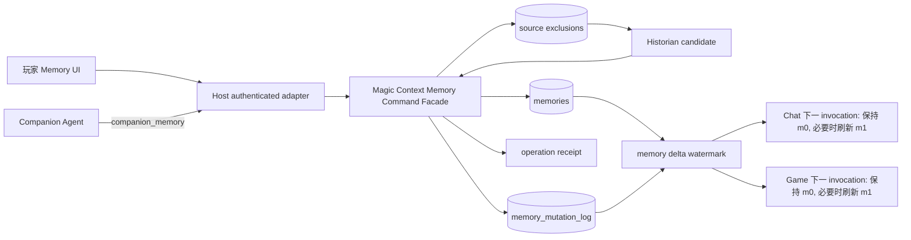
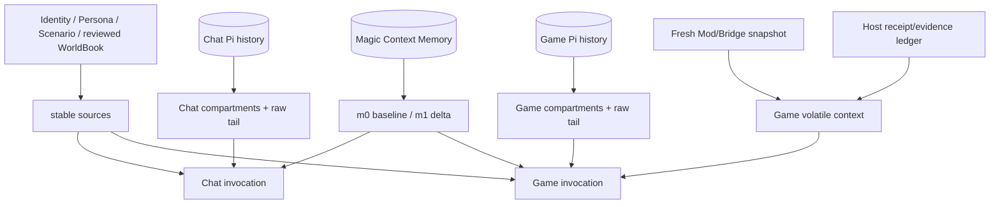

# 04 Context / Memory

> **状态：目标设计；玩家管理、CAS、来源排除、`m[1]` freshness、独立 surface 语义与 Historian 双类型 candidate/promotion 的定向逻辑已实现并有定向验证。Tavern 独立真实-provider 发布门、Game Operational Gate，以及 P7 的 production `auto_promote` reopen decision 仍待收口。**
>
> 本文细化 `00_CORE_PRODUCT.md` 的 Context/Memory 契约。Pi runtime 加载 GameBuddy 锁定的 Magic Context extension；Magic Context 独占长期 Memory 存储、history/compartment 组织、选择与 `m[0]/m[1]` 物化。Host 只认证和路由 typed command，不建立 Host-owned Memory 数据库、检索器或 prompt assembler。具体实施见 [`32_PLAYER_MANAGED_INTERACTION_MEMORY_IMPLEMENTATION_PLAN.md`](32_PLAYER_MANAGED_INTERACTION_MEMORY_IMPLEMENTATION_PLAN.md)。行动权限、停止、取消和 Game Action 的安全执行属于 `02_GAME_ADAPTER_ACTIONS.md` 与 `03_AGENT_RUNTIME.md`，不由 Memory 授予。

## 1. 设计立场

Context 不是每轮从若干 Memory 槽位拼出的 prompt，也不是用自动摘要替代共同经历的系统。

**Chat 与 Game 是独立运行、独立启动/停止/恢复的 surface，不是前后切换的模式。** 两者各自拥有 Pi session、raw history、recent tail 和生命周期；启动、停止或恢复任一方不得暂停、关闭、恢复或改写另一方。它们只有在绑定同一 `CompanionContinuity` 时，才读取同一个长期 Memory partition；这不复制 JSONL、不建立 handoff summary，也不把任何 surface 变为另一 surface 的父级或返回目标。

同一 Continuity 的长期 Memory 是玩家与 Companion 的持续关系材料；其中的 `SEMANTIC_MEMORY` 和 `INTERACTION_EPISODE` 同属一个 active/permanent 候选池。它们不承载实时游戏事实。Chat 的目标是叙事连续、玩家可控和隔离；Game 在此基础上还必须从 Live World、capability、receipt/evidence 得到当前可执行事实。

这意味着：

- raw history、compartment、recent tail、Tavern Persona/Scenario/WorldBook 与 Game Live World 都按各自 surface 归属，永不因共享 Memory 而复制；
- 不将 compaction/summary 作为原始经历的产品替代品；Magic Context 可为有限窗口渲染 historian/compartment 视图，原始 Pi session 历史仍可回看；
- Chat 可以使用稳定设定、recent tail、长期 Memory 与有界检索/摘要；它不需要 Game capability、receipt、action contract、lease 或实时 snapshot；
- Game 的实时状态只在当前调用附近出现，且始终以 Host/Mod authority 为准；
- 不新增 `chat-only` / `game-only` / `shared` Memory visibility schema：没有已证明的产品场景值得承担额外状态、迁移、检索和 UI 成本。不同 Continuity 完全隔离；同一 Continuity 的两种 active/permanent 长期 Memory 均是共同候选池。

“不以摘要替代经历”不声称模型窗口无限；超长 session 的存储、回放和性能优化须另行以真实成本和体验证据决定。

## 2. 以 Magic Context 为物化基础，以 SillyTavern 为角色 Context 语义参考

GameBuddy 不另造一套与 Magic Context 并列的“分层 Context assembler”。锁定的 Magic Context 已有明确的 cache-aware 物化结构：稳定 system prompt、累计基线 `m[0]`、易变增量 `m[1]`，以及位于两者之后的 raw conversation tail。GameBuddy 的设计任务是把产品对象以有来源、可版本化的方式接入这一原生结构，而不是把若干自定义层每轮拼成新 prompt。

SillyTavern 对角色 Context 的核心贡献是区分不同内容的生命周期：Character name/description/personality 与 Scenario 属于持续提供的角色上下文；Persona 表示用户在对话中的呈现；First Message 只在新 Chat 开始时成为一次真实历史；Example Messages 只在 Context 有空间时提供并会被历史挤出；World Info 按当前上下文激活。GameBuddy 保留这些产品语义，并让 Magic Context 负责统一物化，而不是由 Host 另建 assembler。SillyTavern `Scenario` 与 Magic Context 的历史/Memory 并不重合：Scenario 是 Character default / Chat override 的声明式 active premise；compartments、Interaction Episode 与 Semantic Memory 表示实际发生过的互动及其长期意义。两者可以同时存在，内容相关也不能把任一方去重掉；关键是保留不同 source kind、revision、provenance 和 authority，且 Memory 不能静默成为 Scenario override。Scenario artifact 本身不是经历或 promotion 输入，但在该 Scenario 下真实发生的互动仍可按 Magic Context 原生规则形成 compartments/Memory。GameBuddy 同时增加 Game Integration 的权威 Live World。Example Messages 的预算行为只能做 **Magic-Context-aware 的确定性近似**：SillyTavern 会在每次 generation 计算可容纳的完整示例块，而冻结的 `m[0]` 不会逐回合重算；GameBuddy 只能在 materialization 时依据稳定预算和当时的历史压力重选完整块，并在下一次 materialization 前保持选择不变。

目标 source map 为：

| 产品来源 | SillyTavern 参考语义 | 所有者 | Magic Context / 模型输入位置 |
|---|---|---|---|
| `IdentityProfile` | Character name、description、personality 中经审核的稳定身份材料 | Host | canonical、hash-bound 的稳定 system prompt 块；不由 Magic Context Memory 生成或修改 |
| `DialogueExamples` | `mes_example`：有空间时用于示范角色表达，随后可被历史挤出 | Host-owned reviewed artifact | 目标 fork extension 在 materialization 时按 dedicated budget、完整块和稳定顺序确定选择；选择在两次 HARD 之间冻结，不永久塞入 `IdentityProfile` |
| `UserPersona` | 用户在当前角色对话中的呈现 | Host-owned Tavern artifact | Tavern-only versioned source；目标 fork extension 将有效 revision 物化进 `m[0]`，显式修改通过 source-specific `m[1]` replacement/tombstone；可与 Magic Context 历史/Memory 共存 |
| effective `Scenario` | Character default，允许 Chat metadata override；声明当前 Tavern Chat 的 premise | Host-owned Tavern artifact + active `ChatThread` reference | Tavern-only versioned source；目标 fork extension 将 effective revision/provenance 物化进 `m[0]`，修改通过 source-specific `m[1]` replacement/tombstone。它与 Magic Context 历史/Memory 共存，但历史/Memory 不自动选择或覆盖 Scenario |
| reviewed WorldBook | World Info / Lorebook；always-on 与按情境激活内容不同 | Host-owned reviewed artifact | 目标 fork extension 可将极小 always-on premise 放入对应 surface 的 `m[0]`；其余 entry 通过有界 catalog/query 成为有 provenance 的 raw-tail tool result，不复制 ST prompt-position runtime |
| 选中的 First Message / Alternate Greeting | 新 Chat 的 message 0 及其 swipes | `ChatThread` transcript | 只写入一次 raw history；未选 variant 不单独注入。之后随普通历史由 Magic Context 原生 compartment 流程进入 `m[1]`，再在自然 HARD fold 后进入 `m[0]` |
| 玩家与 Companion 的连续互动 | 各自 surface history | Chat/Game Pi session + Magic Context | 各自最新内容保留在 raw tail；各自 compartment 在 `m[1]` 与自然 fold 后的 `m[0]`；Chat/Game JSONL 不复制 |
| `SEMANTIC_MEMORY` | SillyTavern 没有完全等价的权威对象 | Magic Context | 同一 Continuity 的 active/permanent row 与 Episode 共同构成两 surface 的长期 Memory 候选池；稳定偏好、边界、约定、关系事实 |
| `INTERACTION_EPISODE` | 值得长期共同回忆的关系/承诺/共同叙事经历 | Magic Context | 同一候选池中的另一 taxonomy；只收长期互动意义的具体经历。工具/游戏事件只能是背景，不是 Episode 本身 |
| Game snapshot、execution、receipt | SillyTavern 没有的权威实时世界层 | Host / Integration / Mod | 仅在当前 Game session 的 raw tail 附近出现；不写入 Chat baseline、长期 Memory 或当前事实替代物 |
| 当前玩家输入 | 当前消息 | Player ingress | raw tail 最末端 |

这里的 `DialogueExamples` 是从现有 `IdentityProfile.examples` 中分离出的目标对象：SillyTavern 明确把 Example Messages 视为 non-permanent context。实现迁移前旧字段仍是兼容输入，但新 schema 不应把示例对话永久绑定到 identity system prompt。GameBuddy 不声称逐 generation 复刻 SillyTavern 的 token fitting；选择只在 Magic Context materialization 时按当时的 history pressure、dedicated maximum budget、原始块顺序和 whole-block-only 规则确定，超预算从尾部丢弃，随后随 `m[0]` 冻结。

### 2.1 Companion identity 仍独立于 Magic Context Memory

`IdentityProfile` 不是 Magic Context Memory、历史消息、todo、tool result、Persona、Scenario 或玩家偏好。Host 在创建 Pi session 前解析经审核的 profile artifact，按 canonical serializer 渲染到 base `systemPrompt` 的固定 `gamebuddy_companion_identity` 块，并记录 `profileId`、revision 与 content hash。Pi JSONL 与 Magic Context SQLite/historian 保存或组织共同经历；它们不得生成、修改、合并或以摘要替代 identity 块。

IdentityProfile revision 在一个可恢复 session 中冻结。恢复时 profile hash 不同必须 fail closed 为 `identity_profile_mismatch`。未来 profile migration 必须保留旧 artifact/hash，显式建立新 revision 与 lineage，并让玩家确认或撤销；不能通过普通消息、historian summary、Persona、Scenario 或 Greeting 静默改身份。

### 2.2 连续经历由 Magic Context 原生历史生命周期承载

每个 surface 的经历按自身发生顺序进入其 Pi raw history：Chat 保存玩家互动、选中的 First Message 与自然形成的话题；Game 保存自身观察、游戏事件、行动过程与结果。它们不要求 Host 先分类成偏好、关系、任务或 Memory，也不会把另一 surface 的 raw history 复制进来。

每个 surface 的最新历史留在自己的 raw tail；达到 Magic Context 的组织时机后，Historian 发布的新 compartment 以 P1 全量形态进入该 session 的 `m[1]`；自然 HARD materialization 时再由 decay renderer 折入其 `m[0]`。这只是有限窗口中的物化生命周期，不改变原始经历的产品地位，也不允许 Host 另写 handoff summary 或平行 experience ledger。

### 2.3 Live World 始终留在 raw tail 的权威边界

Live World 是靠近当前输入的小型、可替换 Adapter 视图：当前 world/save binding、revision、地点、时间、可观察状态、capability、active execution、receipt 和刚发生的事实。它让 Agent 在 Magic Context 的累计经历之上看见“现在”，但不属于 `m[0]` 稳定角色上下文，也不能因为 historian 或 Semantic Memory 重述而获得当前权威。

## 3. Magic Context `m[0] / m[1] / raw tail` 契约

锁定 Magic Context 的原生布局是实现契约，而不是仅供类比的概念：

```text
stable system prompt
  Host runtime/safety contract
  canonical IdentityProfile

m[0] — cumulative baseline，普通回合保持字节稳定
  GameBuddy typed stable-context block（目标扩展；按 surface）
    Tavern: effective UserPersona / Scenario / budgeted DialogueExamples
    applicable surface: reviewed minimal always-on WorldBook premise
  Magic Context baseline user-profile（GameBuddy 当前不借其替代 UserPersona）
  decay-rendered session-history compartments
  approved ongoing-interaction `SEMANTIC_MEMORY` / `INTERACTION_EPISODE` baseline

m[1] — volatile delta
  GameBuddy stable-context revision replacements since m[0]（目标扩展）
  new compartments at full fidelity
  new memories / memory updates
  new user-profile delta（若该原生能力未来被批准）

raw tail
  selected First Message and recent conversation not yet compartmented
  current surface-specific events
  Game only: current snapshot / execution / receipt
  current queried WorldBook result and player input
```

当前 `0.33.0-gamebuddy.2` 已批准的是 Magic Context 原生 compartment/history 物化，以及同 opaque continuity 的长期 Memory render/management 基础；受明确 `auto_promote=true` 测试配置的 Historian 已可在同一 chunk 提交通过准入的 Semantic 与 Episode candidate，但 production 仍禁止自动 durable write。工作树已经包含 WIP 的 `GameBuddyStableContextSource`、Host publication/clear seam、stable source marker 以及 `m[0]/m[1]` replacement/tombstone rendering；它不是尚不存在的概念接口，但也**尚未通过完整 prerequisite gate**。至少已知 fork materializer 目前只拒绝重复 `(kind, sourceId)`，没有在 Magic Context-owned 边界对 declared single-valued source kind 拒绝多个 effective source；持久 cursor/restart、fold、surface isolation 与 SOFT+/SOFT/HARD 证据也尚未全部闭合。因此 Persona、Scenario、DialogueExamples 与 always-on WorldBook 不得声称已发布进入 `m[0]/m[1]`，Tavern T1/T3 保持 blocked；也不得用 Host synthetic messages、直接 SQLite 写入或复用 `<memory-updates>` 绕过。

该 WIP fork extension 的 prerequisite contract 必须完成：

- Host 只通过受控进程内接口提供 canonical、immutable source snapshot：continuity/session/surface binding、source kind、revision、canonical hash、内容与预算；Persona 与 Scenario 使用不同 source kind，Scenario snapshot 携带 default/Chat-override provenance；Host 不接触 Magic Context cache row、marker 或 renderer；
- fork 内 materializer 独占 source snapshot validation、`m[0]/m[1]` wire rendering、缓存读写与 fold 决策，并为 baseline 保存 source-kind→revision/hash markers；它必须在 Magic Context-owned validation 中（而不只依赖 Host `ChatThread` validator）对每个 declared single-valued source kind最多接受一个 effective revision，但 Persona、Scenario、compartments、`SEMANTIC_MEMORY` 与 `INTERACTION_EPISODE` 可以同时存在；
- source revision、删除和 surface removal 使用新设计的 **source-specific SOFT supersession delta**：它带旧/新 revision、replacement 或 tombstone、稳定序列与持久 cursor；在 `m[1]` 中明确遮蔽旧 `m[0]` source，SOFT+ 重放时逐字稳定，不能伪装成现有 Memory mutation。该 stable-source cursor 与 Memory delta coverage cursor 是两套不同的 Magic Context-owned contract；
- source change 只请求 source-aware SOFT recompute，不自行触发 HARD。HARD 仍仅由 Magic Context 已有合法条件（cache 已失效、system/model/TTL、结构 mutation、pressure backstop 等）触发；HARD 时 fork 内 renderer 将最终有效 source snapshot写入新 `m[0]`，清除已折叠 supersession delta；
- adapter unavailable、snapshot/hash/revision 不一致、surface mismatch、cursor rollback、同一 single-valued source kind 出现多个 effective revision 或未知 source kind一律 fail closed，不回退到 Host prompt 拼接；不同 surface 只读取自身允许 source，Game session 没有 Tavern Persona/Scenario/DialogueExamples source 或 Tavern message history operations，但同 Continuity 的 Magic Context history/Memory 仍按原生规则存在。

Magic Context 三档 cache 行为继续成立：

```text
SOFT+  m[0] 与 m[1] 均逐字重放；只移动 raw tail
SOFT   m[0] 不变；m[1] 因新 compartment、Memory 或已验证 source supersession 重渲染
HARD   在合法 materialization 条件下重建 m[0]，reconcile/fold m[1]，再重置 m[1]
```

因此 `m[1]` 不是“所有变化内容”的统称，也不保证每个普通回合都重新读取 artifact。fresh snapshot、receipt、surface-entry 和当前玩家输入仍在 raw tail；First Message 是一次真实 Chat history，不是 permanent baseline block；未选 Alternate Greetings 不进入任何模型 Context。缓存策略不能要求 Agent 忽略经历，也不能把 Scenario/Persona artifact 或 WorldBook误称为 Memory。effective Scenario source 与 historian compartment/长期 Memory 可以共同出现：前者提供声明式当前 premise，后者提供已发生互动；rendering 必须保留标签和 provenance，使模型不能把 Memory 内容误认为 Scenario override。

同一 Game surface 在同一个 world binding 下重连时，Magic Context 不创建新活动层：既有 `m[0]/m[1]` 与该 Game 历史保留，fresh `surface_entry + snapshot` 进入该 Game raw tail；Agent 据此自行决定接续、重估、表达或安静。

## 4. 用户可见 Session 与同一 Continuity

一条 `CompanionContinuity` 是同一玩家与同一 Companion 的共同经历，而不是永久常驻的单个 Pi `SessionManager`。它至少绑定 Host-owned `IdentityProfile`、经审核的 WorldBook binding、同一条 Magic Context historian/compartment 归属和用户可见的 session 关系；Magic Context 仍是连续经历的组织、渲染与原始历史回看层，不另造平行 memory/summary engine。

Pi 的工具面在创建时冻结，因此 Chat 与 Game 各自使用独立 Pi session。两种 surface 可并存、独立创建、恢复、停止和崩溃恢复；任何一方的 lifecycle 都不得启动、停止、暂停、恢复、替换或要求另一方的 session。没有 `Chat → Game`、`Game → Chat`、origin Chat、return Chat 或 handoff 产品流程。它们不复制 JSONL、不写 handoff summary，也不把 Game tool/result 注入 Chat JSONL；Game bridge/tool/subagent trace 不直接显示或整段复制入 Chat transcript。

同一 `CompanionContinuity` 是长期 Memory partition 的稳定归属，不是模式切换或 surface 父子关系。当前 identity 映射使同一 partition 的 active/permanent `SEMANTIC_MEMORY` 与 `INTERACTION_EPISODE` 成为 Chat/Game 的共同候选池；两个 surface 的 raw history、compartment、tail 和 session 始终独立。Host 永远没有 SQLite、raw query、retrieval、promotion、handoff 或 prompt-render authority；玩家/Agent 管理只由 Host 把已认证 continuity-bound typed command 转给 Magic Context-owned facade。

生产 `auto_promote` 保持关闭，直到 `32` 的 P7 明确决定重开。关闭时 Historian 仍按 context-pressure scheduler 组织 compartments，但不提交任一长期 Memory。重开后 Historian 必须可在严格准入下同时产生 `SEMANTIC_MEMORY` 和 `INTERACTION_EPISODE`，而不是只产生前者。`auto_search`、embeddings、Dreamer、Sidekick、project-memory、RAG、Git/docs injection 与 Host-built recall 继续关闭。无论是否启用，receipt、摘要或任一 Memory 都不能升级为当前游戏事实；当前世界、权限和 Action 成功只来自 active world binding、Host 与 Mod。

`New Chat` 是 Chat surface 的用户可见 session 创建动作，绝不由资源策略代替：它在同一 Companion、同一 `CompanionContinuity` 下创建新的 `ChatThread`，不承诺忘记既有长期 Memory。`New Companion` 才创建新的 Companion identity 与 Continuity。它们均不影响已有或未来独立运行的 Game surface。

SillyTavern 式 branch/checkpoint 与普通 New Chat 不同：它表达从历史节点派生的替代对话时间线。Branch 创建并激活 fork；Checkpoint 创建并链接命名 fork，但保持当前 Chat，稍后打开时再切换。两者都必须建立新的 `CompanionContinuityId`/Magic Context partition 并记录 parent lineage；Host 只能调用 GameBuddy-owned、版本锁定的 branch/materialization API，不能手工复制或修改任意 Pi/Magic Context 文件，也不能回滚或改写已发生的真实 Game side effect。只有锁定 Pi/Magic Context 版本能证明 branch materialization、partition isolation、恢复与删除时才能发布。纯 Chat 的 retry/swipe 可在无外部副作用的回复位置维护 `MessageVariant`；一旦回合关联 Game Action、已提交 presentation 或其他不可撤销 effect，就不得用 swipe/edit 假装其未发生。详细 domain contract 见 [`24_TAVERN_COMPATIBILITY_IMPLEMENTATION_PLAN.md`](24_TAVERN_COMPATIBILITY_IMPLEMENTATION_PLAN.md)。

当前 Pi `SessionManager` 的 append-only JSONL、全量索引与 Magic Context Pi adapter 的 branch walk 会使单个超长用户可见 session 增加内存、恢复和 transform 成本。这不允许成为后台自动切换、删除、摘要替代或新建玩家可见聊天的理由。对单个超长 Chat session 的内存问题，优先在 GameBuddy 锁定的 Pi/Magic Context fork 中研究惰性加载、archive-aware storage 或有界 branch materialization；这些是**同一可见 session 的性能优化**，不得改变用户可见 session/continuity 边界。任何 fork 不得修改、读取或依赖用户已安装 Pi、其用户目录、session、settings、extensions、skills 或 credential。

### 4.1 Tavern Character Context 的原生 source lifecycle

酒馆以 `ChatThread` 组织同一 Companion 的玩家可见角色对话，而不是另一个权威模拟世界。这里直接参考 SillyTavern Character Context 的生命周期，而不是只借字段名称：

- Character Name/Description/Personality/Scenario 属于 SillyTavern 所谓 permanent character context；GameBuddy 将经审核的稳定身份材料放入 Host system prompt 的 `IdentityProfile`，保留 effective Scenario 为独立 Tavern stable-context source；它可以与 Magic Context 物化的实际历史/Memory 同时影响对话；
- Persona 是用户在 Tavern 中的呈现，与 account、Attachment 和游戏 identity 分离；它是独立的 Tavern stable-context source，不是 Magic Context user-profile、永久玩家事实或 Semantic Memory；
- Example Messages 示范 Character 的会话风格，但 SillyTavern 默认只在 Context 有空间时保留。GameBuddy 对应为独立 `DialogueExamples`，按完整示例块、预算和稳定顺序物化，不永久并入 IdentityProfile；
- First Message 只在 Chat 开始时出现一次；Alternate Greetings 是同一第一条消息的 swipes。用户选中的 variant 先持久化为 message 0，之后只按普通 raw history → compartment → `m[1]` → `m[0]` 生命周期存在；未选 variants 不进入模型输入；
- World Info/Lorebook 提供有条件的背景 Context。GameBuddy 保留多来源 binding、provenance 和按需读取，但不复制任意 prompt position、递归、脚本或随机激活 runtime。

`ChatThread` 另持久化 active Persona/Scenario references，以及 `openingSelection=blank | greeting(sourceRevision, variantId, messageId)` 与可选 `openingLockedAtEventId`。Persona/Scenario references 是产品 metadata；目标 fork extension 根据它们解析各自的 effective Tavern source revision，并与 Magic Context 原生历史/Memory 一起物化。`blank` 是 GameBuddy 提供的明确无气泡 sentinel，不冒称 SillyTavern 原生 First Message 行为；未完成的 `pending` 不可恢复。尚无玩家/其它 Companion 消息、外部 effect 或 branch child时，blank↔first/alternate 可原子切换；首个后续 event 锁定 opening。恢复已有 Chat、浏览器重连或 Host restart 均只恢复 opening state，不新建或重播 message 0；独立 Game surface 的运行或结束不影响该 state。

独立 Game surface 不复用 Tavern First Message，也不创建固定 Game Greeting artifact。它 materialize 时 source extension 必须排除 Tavern-only Persona、Scenario 与 DialogueExamples source，而不是只隐藏 UI；同 Continuity 的 Magic Context compartments/Memory 不因此删除。fresh binding/snapshot 到达后，`surface_entry`、snapshot、execution 与 receipt 都进入当前 Game raw tail，它们不是 Magic Context `m[1]` stable-source delta。Agent 结合 IdentityProfile、Magic Context 已物化的共同经历、当前输入和 fresh Live World 自行决定表达、观察、行动、接续或安静；Host 不自动生成台词，也不把 Tavern Scenario 编译为 Game observation。Game 也不挂载 Tavern message mutation、variant、branch-from-message 或 per-message narration/replay interface。

WorldBook 是 Host-owned、版本化、可查看的 artifact，至少带 `worldBookId`、revision、canonical hash、来源、scope、适用条件、token budget 与每个 entry 的 provenance。绑定来源可为 setting/global、companion、persona、chat 或 integration/world；矛盾来源不静默覆盖。稳定且极小的 always-on premise 可由 Magic Context typed source adapter 进入对应 surface 的 `m[0]/m[1]`；其余条目经 catalog/query 按需取得，作为有来源的 raw-tail tool result。两者都不能覆盖 `IdentityProfile`、原始共同经历、当前 snapshot、ActionPolicy 或 receipt。

ST V2/V3 card 的 Character/Scenario/Example Messages/Greeting/`character_book` 只能先成为待审核候选；`system_prompt`、post-history instructions、regex、macros、scripts、HTML、extensions、preset、外部资源和任意注入位置默认不执行。游戏/存档 scoped 条目只有对应 active world binding 存在时才可查询。详细 safe-subset mapping 遵循 `24`。

## 5. 不过度控制 AI

Context 结构应保证信息的时间位置和来源边界，但不将 AI 变成受限的检索器或状态机。

不采用下列机制作为默认设计：

- 用 Magic Context 的 `ctx_memory`、dreamer、historian facts、auto-search 或历史摘要保存/修改 Companion identity；
- 把 IdentityProfile 作为 player/user/custom session message 注入，令其与共同经历或玩家内容同一优先级；
- “任务类型 → 只允许某些 Memory kind/scope”的可见性白名单；
- 每轮固定分配人格、关系、偏好、事件、经验等 token 槽位；
- “没有关键词命中就不得联系过去”的规则；
- 为了证明长期记忆而主动插入旧事；
- 自动的关系状态机、情绪推断或将行为推测固化为 AI 必须遵守的长期设定；
- 以 tracker、世界书或摘要取代当前现场与连续经历。

AI 应能看到连续经验并自由决定：是否联想过去、如何表达、是否延续一个玩笑、是否承认不确定、是否安静。系统仅需保证 Live World Context 来自 Adapter，以及行动的权限、停止和结果由其各自的运行时边界负责；这些边界不应被包装成本文的“Player Control Context 通道”。

## 6. 玩家可管理的 Ongoing Interaction Memory

本文区分**连续历史**、**长期互动 Memory**和**执行知识**。它们可源于同一事件，但必须进入不同的数据层。

| 内容类型 | 准入语义 | 权威位置与例子 |
|---|---|---|
| Working Context | 当前模型调用实际看见的有界输入 | stable prompt、Magic Context `m[0]/m[1]`、raw tail 中的 fresh Live World 与当前输入；不是长期存储 |
| Continuous History | 实际发生过的原始对话、游戏事件、行动过程和结果 | Pi raw history、Magic Context compartments；保留共同经历与必要工具过程，但 compartment 不因存在就成为长期 Memory |
| `INTERACTION_EPISODE` | 一段对玩家—Companion 的关系、承诺、共同叙事、情绪理解或未来互动方式具有持续意义的经历 | Magic Context `ongoing-interaction` 目标 category；如重要第一次、误会与和解、共同仪式、承诺形成。工具或游戏事件只能作为背景 |
| `SEMANTIC_MEMORY` | 脱离单次时间后仍长期成立的玩家偏好、互动边界、约定、关系事实或共同表达 | Magic Context `ongoing-interaction`；如“重大剧情选择前先给玩家选项，由玩家决定” |
| Procedural / Execution Knowledge | 如何可靠、安全地行动 | tool/action contract、planner、Mod validation、tests 与 incident/receipt ledger；不得依赖长期 Memory 保证正确 |

`INTERACTION_EPISODE` 的正式定义是：

> 同一 `CompanionContinuity` 中，一段有可辨识互动边界，并对玩家与 Companion 的关系、承诺、共同叙事、情绪理解或未来互动方式具有持续意义的共同经历。它可被玩家修订；不代表当前游戏状态，也不替代权威 receipt/evidence。

`SEMANTIC_MEMORY` 与 `INTERACTION_EPISODE` 不是 Chat/Game 可见性分区：同一 Continuity 中，两类 active/permanent row 都是两个独立 surface 的共同候选池。分类仅表达内容形态：前者是可脱离单次经历的稳定结论，后者保留具有持续意义的具体经历。

准入必须同时满足：

1. 玩家与 Companion 之间存在可辨识互动，而非只有 tool call、snapshot 或游戏状态转换；
2. 忘记该经历会明显损害陪伴连续性；
3. 长期价值来自关系、承诺、共同叙事、情绪理解或互动方式，而非只让工具下次执行正确；
4. 当前世界、capability、action 成功与精确执行过程仍由 Live World、Mod 和 Host ledger 权威提供；
5. 玩家没有删除或排除其来源。

强准入信号包括玩家明确要求记住、后来主动回忆、形成共同约定、关系/信任发生变化、有意义的道歉与和解、形成双方特有的称呼/笑话/仪式，或玩家赋予某次游戏事件明确纪念意义。单纯的“失败 → 纠正 → 成功”不构成 Interaction Episode。

例如背包已满导致收获失败、清理后成功，应拆分为：失败和成功 receipt 留在 Host ledger；容量前置条件进入 action contract/planner/Mod validation 与 regression test；当前容量来自 fresh snapshot。只有当玩家—Companion 围绕这件事形成具有持续关系意义的共同表达或承诺时，互动部分才可成为 `INTERACTION_EPISODE`。工具失败应让执行系统更正确；互动经历应让 Companion 更懂玩家。

`IdentityProfile` 是“她是谁”的 Host-owned stable source；`UserPersona` 与 `Scenario` 是 Tavern 声明式 stable sources；`DialogueExamples` 是可被预算挤出的角色示例；选定 `GreetingVariant` 是 message 0 的 Continuous History；Magic Context compartments、`SEMANTIC_MEMORY` 与 `INTERACTION_EPISODE` 承载实际互动；`WorldBook` 是审核过的背景资料；Live World 是当前游戏权威。它们不得压平为来源不明的“memory prompt”，任何历史/Memory 都不能替代当前 Live World。

### 6.1 玩家治理与 Agent 代理

玩家拥有最终纠正权，但**每条 Memory 不需要单独 confirm**：

- 玩家直接 create/update 已是对该 revision 的明确表达，立即生效；Magic Context 必须在同一 mutation transaction 内把该 current revision 标记为 player-authored/player-corrected，不能只把 principal 留在 Host receipt；
- 玩家在当前回合明确委托 Agent 记住或修改，也足以授权该次 mutation；operation receipt 仍记录实际 principal，Agent 不伪装成玩家；若该命令是在修改既有 inferred Memory，是否取得 player-protected priority 必须由 facade 的明确命令语义决定并原子持久化；
- Agent/Historian 自主生成的是可纠正推断，不得覆盖玩家创建、纠正或 pinned 的 Memory；冲突返回结构化 conflict，不静默 last-write-wins；
- pin/unpin、修改/归档/恢复/合并/删除 current revision 为 `governance.authority=player` 或 `status=permanent` 的 Memory、exclude source 和隐私擦除等操作，Agent 只有在当前回合存在明确委托时才能执行；该保护按当前 governance/status 判断，不按最初 `source_type` 判断；
- `verification_status` 保留 Magic Context 的现有内部语义，不升级为玩家审批状态机。当前没有足够收益证明需要独立 attestation schema 或持久 review queue。

玩家 UI 与受限 `companion_memory` tool 共享同一个 **Magic Context-owned Memory Command Facade**。Host 只认证当前 principal、continuity/surface binding、命令 schema、deadline 和 expected-state token，再把命令传给 facade；不接受任意 `project_path`、不读取或写入 SQLite、不自行检索和渲染 Memory。Dialogue HTTP construction 必须把 read projection 与 mutation capability分开：read可独立挂载；所有玩家mutation（包括`exclude-source`）只走同一 evidence-bound capability，capability缺失时fail closed，不回退普通facade或按环境选择较弱写路径。该evidence是authenticated current-session/next-round执行绑定，不是第二次玩家confirm。具体destructive接线卡见 [`32_PLAYER_MANAGED_INTERACTION_MEMORY_IMPLEMENTATION_PLAN.md`](32_PLAYER_MANAGED_INTERACTION_MEMORY_IMPLEMENTATION_PLAN.md) P6.1 与 [`39_NON_ACTION_ENGINEERING_REMEDIATION_IMPLEMENTATION_PLAN.md`](39_NON_ACTION_ENGINEERING_REMEDIATION_IMPLEMENTATION_PLAN.md) P2。目标命令集为：

```text
list / get / create / update / archive / restore
pin / unpin / merge / delete-entry / exclude-source
```

每个 mutation 使用由当前 row 状态派生的 opaque `expectedStateToken` 做 CAS；stale UI/Agent 写入 fail closed 为 `memory_revision_conflict`。玩家 create/update 或当前回合明确委托的 Agent mutation 已是充分授权，不再增加 `confirm`。

### 6.2 最小数据模型与必要性约束

目标第一阶段**不扩张 `memories` 行 schema**。复用现有字段：

| 需求 | 复用字段/机制 |
|---|---|
| Continuity partition | canonical opaque runtime identity 映射到现有 `project_path` |
| Semantic / interaction episode | `category`；只增加受控 taxonomy 值 `INTERACTION_EPISODE` |
| 创建来源 | `source_type = user | agent | historian | dreamer` |
| 当前 revision 的玩家优先级 | 受控 `metadata_json.governance.authority = player | inferred` 与 mutation principal 同事务更新；它描述当前 revision，不改写原始创建来源 |
| enabled / pinned / disabled | `status = active | permanent | archived` |
| correction / merge | update、`superseded_by_memory_id`、`merged_from` 与 mutation log |
| CAS | `id + updated_at + normalized_hash + status + superseded_by_memory_id + governance authority` 派生 opaque token |
| 来源解释 | 受控 `metadata_json.source_refs`；不进入 Prompt |

`metadata_json.governance.authority` 是复用现有 metadata 容器的最小治理 contract：玩家直接 create/update 设为 `player`；Agent/Historian自主 create/update 设为 `inferred`；明确委托的 Agent 只有在命令明确要求“采用为玩家修订”且通过 delegation policy 时才可设为 `player`。该值参与 CAS、conflict、merge 与 promotion 判定，Host receipt 只做审计而不是 facade 的唯一依据。编辑后 authority 随新 revision 原子确定，不能从旧 content hash 隐式继承。

`source_refs` 只保存同 Continuity 内经 facade 验证的 opaque locator，例如 `pi-message`、`pi-range` 或 `host-receipt`。它不复制原消息或 receipt 正文，Memory 对 receipt 的引用也不取得 receipt 权威。只有当真实查询/索引需求证明 `metadata_json` 不够时，才可把 provenance 升格为独立表。

不新增 `title`、`tags`、`surfaceId`、`visibility`、`origin`、`pinned`、`activation`、`revision`、`companionId`、`tombstoned` status 或强制 `review_queue`。每个未来字段必须同时证明：存在具体 Tavern/Game 场景；现有字段、派生值或 metadata 无法满足；收益大于存储、迁移、Prompt、隐私、并发和 UX 成本。

### 6.3 删除、来源排除与隐私擦除

四个操作不得混同：

| 操作 | 语义 |
|---|---|
| archive | 停止注入但保留正文，可 restore |
| delete-entry | 删除当前结构化 Memory 与派生 embedding；不自动删除原始聊天 |
| exclude-source | 指定 opaque message/range 不再具有 Historian promotion 资格 |
| erase-source-history | 删除原始聊天及其派生内容的独立隐私工作流；不属于本计划第一阶段 |

来源排除若获实现，使用最小 `memory_source_exclusions(project_path, source_ref, created_at, principal/operation reference)` 或经验证等价结构，不保存被排除正文。Historian 构造候选和 commit promotion 两处都必须检查；覆盖已排除 range 的旧 compartment 也不得再次晋升。删除 Memory 不应静默排除整条来源，因为一条消息可能包含多个有效事实；玩家或受明确委托的 Agent 必须显式选择 exclude-source。

### 6.4 Memory mutation 的同分区可见性

当前 fork 的 `cached_m1_bytes` 在 defer pass 逐字 replay；新增 Memory 和 mutation 只在下一次 cache-busting pass 重渲染。玩家从 Web 管理通道修改 Memory 后，任一独立 surface 的下一次 invocation 因而可能继续看到旧 `m[1]`。目标不是 Host fan-out、surface handoff 或额外 Agent 回合，而是 Magic Context-owned 的持久 coverage contract：

```text
Memory command commit
  → Memory / mutation monotonic watermark 前进
  → 各 surface 在自己的下一次 LLM invocation 前比较已消费 cursor
  → 有未消费 delta：保持 m[0] 字节不变，只执行 source-aware SOFT m[1] refresh
  → 无 delta：继续 byte-identical SOFT+ replay
```

coverage marker 必须与 `cached_m1_bytes` 在同一事务持久化，至少覆盖新增 Memory ID 与 Memory mutation ID；确切 schema 名称由 `32` 的代码 spike 冻结，不能误用现有 `cached_m0_max_*` markers 作为“m[1] 已消费”证明。该 contract 必须支持同一 Continuity 的不同 Pi surface session、tool continuation、Host restart、cold start、并发 mutation 和 contention fallback；它不让 Memory edit 触发 HARD fold 或模型回合。

### 6.5 数据流与权威边界





Chat/Game raw histories 不复制；同一 Continuity 的全部 active/permanent `SEMANTIC_MEMORY` 与 `INTERACTION_EPISODE` 共同构成长期 Memory 候选池。Game snapshot、capability、receipt/evidence 始终高于任何 Memory。Memory mutation 不主动触发 Agent 回合，也不启动、停止或恢复另一 surface。

### 6.6 当前实现与 rollout gate

当前实现已有 `ongoing-interaction` 的两类 category、玩家 API/UI、command facade、CAS、受控 provenance/source exclusion、`m[1]` next-invocation freshness，以及 production `auto_promote=false`。Historian 的 prompt/output parser、promotion allowlist 与 admission validator 现已允许同一 chunk 的 `SEMANTIC_MEMORY` 与通过 Episode 准入 gate 的 `INTERACTION_EPISODE` 共同走 source exclusion、dedup、durable write、mutation watermark 与 embedding 链路；tool/receipt/snapshot-only 内容被拒绝。为避免上游默认值漂移，`ongoing-interaction` 只有显式 `autoPromote === true` 才允许 promotion；production 关闭时，两类自动 promotion 均不可写入，玩家显式命令仍可管理两类。

source exclusion 只约束未来 Historian candidate/promotion，且在 candidate 构造与 commit 两处检查；它不删除、archive 或立即隐藏已有 direct Memory row，也不生成可渲染 Memory mutation。`archive` 则保留可列出的 archived row 但停止注入；`delete-entry` 删除该结构化 row/embedding，二者均不等同原始历史擦除。

后续 rollout 是：以 Tavern Narrative Gate 用独立 Chat 的真实 provider invocation 证明两类 current revision 的 prompt materialization、Continuity isolation、archive/delete 的不注入与预算降级；该 gate 不把 non-deterministic 模型回答当作 materialization 证据。Game Operational Gate 另行证明独立 Game surface 对共同候选池的可见性与 Live World 优先。P7 仅在全部逻辑与适用 live gate 通过后，显式决定是否重新开启两类的 `ongoing-interaction` auto-promotion。

跨 Continuity 的 Memory、跨设备同步、加密、导入/导出、原始历史隐私擦除与持久候选审阅队列仍是后续产品问题。它们不能进入每轮 Context 组装，也不能被第一阶段假装解决。完整 implementation plan 见 [`32_PLAYER_MANAGED_INTERACTION_MEMORY_IMPLEMENTATION_PLAN.md`](32_PLAYER_MANAGED_INTERACTION_MEMORY_IMPLEMENTATION_PLAN.md)。

## 7. 参考机制与明确排除

- `vendor/magic-context`，锁定 fork `0.33.0-gamebuddy.2`，MIT：GameBuddy 实际运行的 Context/Memory 基座；采用 stable baseline + volatile delta、cache-aware transform、长期 session、historian/compartment 渲染、原始历史回看与 todo。当前已具备同 opaque continuity 的两类 Memory render/management，以及 Historian 双类型 candidate/promotion 的定向逻辑基础；真实 provider evidence 仍须按 `32` 收口。dreamer、Git/docs injection、auto-search、embedding、Sidekick、project-memory/RAG 与 Host-built recall 保持关闭。治理 gate 通过前 auto-promotion 必须关闭。
- `ref/external/pi`，commit `cee5ff7520d8828bed9955ef00419e995d1f91e0`，MIT：可参考 append-only session/event 组织、稳定 ID、分支/回放和 schema 演进的工程思路；它不定义本产品的连续 Context 或 Memory 语义。不得带入 coding harness 的 shell、文件编辑、TUI、工具权限或 prompt。
- `ref/external/ST-BaiBai-Book`，commit `9128a54eff3af3f6c5903ea2a4679ab1c04db0ff`，许可证未知：其历史与当前状态分槽、当前状态靠近最新聊天、完整性不可伪装的观察可用于讨论 Context 的信息位置。**不复制代码**，不采用其自动摘要森林、跑团变量/NPC 状态机或向量召回作为默认方案。
- `ref/external/SillyTavern-MemoryBooks`，commit `9fc9abb6837e59b1d5c9672b87e72e360cf1041f`，AGPL-3.0-only：借鉴玩家审阅、message/range provenance、branch-aware source 与 memory/tracker/consolidation 分离；**仅机制讨论**，不复制代码、prompt 或 Lorebook 依赖。
- `qvink/SillyTavern-MessageSummarize`（研究时核对的外部参考，非 vendored runtime）：借鉴玩家对消息/摘要的 Edit、Remember、Exclude、Delete 是不同治理动作；不复制代码或 prompt。
- `muyoou/st-memory-enhancement`（研究时核对的外部参考，非 vendored runtime）：借鉴结构化浏览与批量管理 UX；不引入其表格 schema 或运行时。
- `ref/external/Liyuan-Tavern-Reference`，本地锁定 commit `cc5658552136a04c2485d99dd0f9fca7da5c8ea6`：借鉴 narrative/external/custom 分库、角色/会话 scope 与手动/自动通道分离；不采用其 store 作为第二套 Memory authority。
- `ref/external/yuzuki-Memory`，commit `226ae944d471c7a1fd7c319e3bf93679fdb1f4e1`，许可证与可验证入口未知：不作为实现依据，禁止复制。

## 8. 验证问题

数据层和逻辑 gate 必须先证明：

1. 独立 Tavern Chat 在玩家 create/update/archive/restore/pin/delete 后，**同一 Chat surface 的下一次 invocation**看见 exact mutation；不产生额外 Agent 回合，`m[0]` 保持 byte-identical。
2. 独立 Chat 与独立 Game 可并存；启动、停止、恢复任一方不影响另一方，且不存在 enter/return/handoff raw history。
3. 绑定同一 Continuity 时，任一 surface 的玩家或受委托 Agent mutation 在另一独立 surface 的下一次 invocation 可见；未绑定同一 Continuity 时完全不可见。
4. 同一 Continuity 的 `SEMANTIC_MEMORY` 与 `INTERACTION_EPISODE` 全部进入共同候选池，但不复制 raw Chat/Game JSONL、compartment、Tavern sources 或 Game Live World。
5. stale expected-state token、并发 UI/Agent mutation、cursor rollback 和 contention 都 fail closed，不出现 last-write-wins 覆盖。
6. delete-entry 与 exclude-source 保持不同语义；排除后的 raw message、range 或覆盖它的旧 compartment 均不能再次 promotion，Host restart 后仍成立。
7. `INTERACTION_EPISODE` gate 拒绝 tool call、snapshot、普通任务、执行失败—恢复流水账；接受有明确持续互动意义的关系、承诺、共同叙事或情绪经历；Historian 与所有显式写入入口都使用同一 gate，并可与 `SEMANTIC_MEMORY` 同时产生。
8. Memory 引用 receipt 不复制或改写 receipt；import/player/Agent Memory 均不能授予 capability、伪造 Action 完成或覆盖 fresh Live World。
9. 玩家 create/update 不需二次 confirm；自主 Agent/Historian 冲突不覆盖玩家 revision；破坏性代理操作要求当前回合明确委托。
10. SOFT+ 无新 delta 时 `system prompt + m[0] + m[1]` 逐字稳定；Memory delta 只触发 source-aware SOFT `m[1]` refresh；合法 HARD 后唯一 fold，不产生永久 mutation drift。
11. Persona、Scenario、DialogueExamples、history、Memory 与 WorldBook 保持 provenance；Game materialization 没有 Tavern-only sources；这源于独立 surface scope，而不是从 Chat 进入/返回 Game。
12. Tavern Narrative Gate 与 Game Operational Gate 分开：前者以真实 Chat provider 验证叙事 Memory，后者以真实 Game surface 验证共同候选池可见性和 Live World 冲突优先；任一 gate 不替代另一 gate。

评估记录应聚焦：mutation 可见延迟、m[1] 重渲染率、prefix-cache 稳定性、Continuity 泄漏、冲突/复活率、工具流水账误晋升率、无端旧事提及率和当前现场误解率。完整场景见 `09` 与 `32`。

## 9. 尚未决定的问题

跨 Continuity Memory、跨设备同步、at-rest encryption、import/export、原始聊天与全部派生物的隐私擦除、持久 `memory_proposals`/批量审阅、Interaction Episode 的自动 promotion 阈值、玩家可选 attestation、provenance 是否因实际查询压力升格为独立表，以及单个超长 session 的 storage/performance 优化仍保持开放。玩家可直接管理 Memory、受限 Agent 代理、无强制 confirm、`INTERACTION_EPISODE` 边界、source exclusion 和 next-invocation mutation freshness 已不再开放；具体 contract 见 `32`。

## 10. 关联来源

- [`00_CORE_PRODUCT.md`](00_CORE_PRODUCT.md)
- [`README.md`](README.md)
- [`research/context-memory-report.md`](research/context-memory-report.md)（早期调查；其中 compaction/retrieval 假设不构成当前 Context 设计）
- [`../ref/external/magic-context/packages/docs/src/content/docs/concepts/cache-architecture.md`](../ref/external/magic-context/packages/docs/src/content/docs/concepts/cache-architecture.md)
- [`../ref/external/pi/packages/coding-agent/docs/session-format.md`](../ref/external/pi/packages/coding-agent/docs/session-format.md)
- [`../ref/external/ST-BaiBai-Book/src/memory/inject.ts`](../ref/external/ST-BaiBai-Book/src/memory/inject.ts)
- [`research/sillytavern-product-semantics-report.md`](research/sillytavern-product-semantics-report.md)
- [`24_TAVERN_COMPATIBILITY_IMPLEMENTATION_PLAN.md`](24_TAVERN_COMPATIBILITY_IMPLEMENTATION_PLAN.md)
- [`32_PLAYER_MANAGED_INTERACTION_MEMORY_IMPLEMENTATION_PLAN.md`](32_PLAYER_MANAGED_INTERACTION_MEMORY_IMPLEMENTATION_PLAN.md)
- [`../ref/external/SillyTavern-MemoryBooks/userguides/howSTMBworks-en.md`](../ref/external/SillyTavern-MemoryBooks/userguides/howSTMBworks-en.md)
- [`../ref/external/Liyuan-Tavern-Reference/src/memory/types.ts`](../ref/external/Liyuan-Tavern-Reference/src/memory/types.ts)
