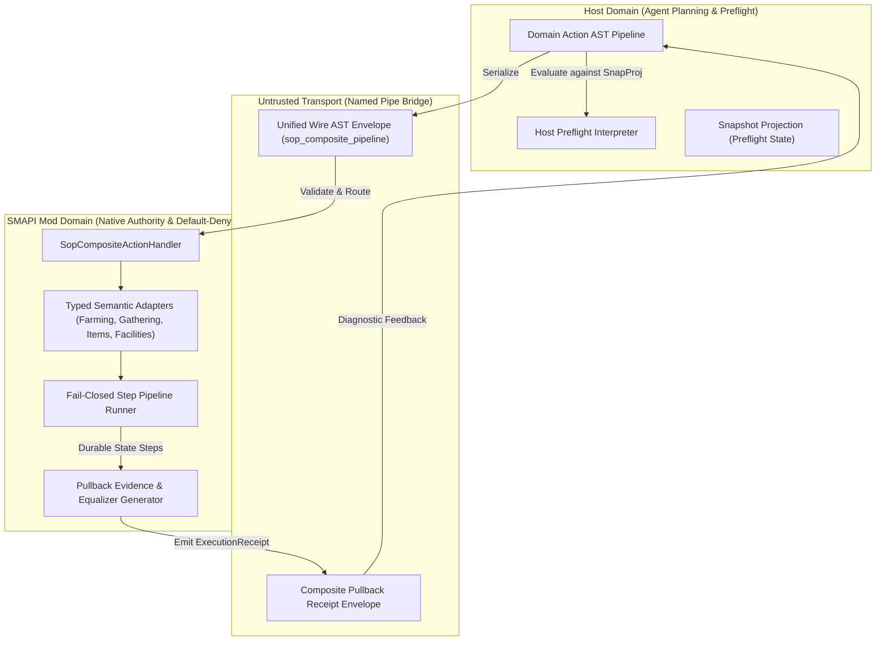

# 85 Category-Theoretic Action, Evidence, and State-Optics Architecture Specification

> **Status:** Superseded by `design/91_OPEN_GAMEPLAY_PIPELINE_RELEASE_IMPLEMENTATION_PLAN.md`. The generic SOP/composite runtime below is retired because it adds no capability beyond the Agent's ordinary `observe → typed action → observe` loop. Preserve only the laws folded into the unique production pipeline; do not implement or revive this runtime.  
> **Applies to:** `host/` (Companion Host Runtime), `integrations/stardew/` (SMAPI Mod & Core Library), `protocol/` (Bridge Protocol & Schemas).  
> **Core Principle:** Replace imperative glue code, fragmented turn round-trips, and ad-hoc receipt checking with clean, mathematically grounded primitives (Declarative Action AST Pipelines, Fail-Closed Pipeline Composition, Pullback/Equalizer Verification, and Sub-Domain Projections) while strictly adhering to Mod-owned default-deny action authority, typed domain semantics, durable step-boundary preservation, and zero-over-engineering constraints of `AGENTS.md`.

---

## 1. Context & Motivation

In the current GameBuddy runtime:
1. **Discrete Turn Round-Trips for Composite Actions:** Game actions (`equip_tool_slot`, `till_soil`, `water_crop`, `harvest_crop`) are isolated single-step Remote Procedure Calls. Executing a standard sequence (e.g. "equip hoe -> till dirt -> equip watering can -> water crop") requires either multiple Agent turns over the Named Pipe Bridge or hardcoded handler shortcuts in the C# Mod.
2. **Defensive Pipeline Boilerplate:** In the SMAPI Mod, action precondition validation, state locking, execution ticking, postcondition verification, and receipt creation are scattered across manual conditional branches and rollback logic.
3. **Ad-Hoc Evidence Validation:** Action receipts contain heterogeneous status fields and disparate state records, requiring bespoke assertions rather than a mathematically unified proof of state transition.
4. **Preserving Strict Domain Boundaries vs. Raw Physical Injections:** The system strictly prohibits raw coordinates, arbitrary UI input injection, generic untyped dispatchers (such as generic `checkAction` or unchecked `Tool.DoFunction` routing), and arbitrary native-call fallbacks. All actions must operate on **opaque observation handles** and **Mod-authorized domain morphisms backed by typed semantic adapters**.

Category Theory and Algebraic Modeling provide practical, foundational abstractions that solve these architectural problems without violating security invariants:
* **Declarative Action Functors ($\mathcal{F}_{\text{Domain}}$) & Typed AST Pipelines**: Decouples domain action syntax (what composite SOP the Agent wants to run) from execution semantics (how SMAPI runs it on the game loop vs. how Host preflights it locally against cached snapshots).
* **Fail-Closed Sequential Pipelines ($\mathbf{Kl}(T)$ / Railway-Oriented Composition)**: Composes effectful, fail-closed Mod-side operations with automatic error propagation, step-boundary preservation, and short-circuiting.
* **Pullbacks & Equalizers ($S_{\text{exp}} \times_{T} S_{\text{act}}$)**: Formalizes receipt verification as a commutative diagram over state projections, eliminating ritualistic hashing and string scraping.
* **State Projections & Domain Optics**: Unifies deep state access and sub-domain snapshotting with pure functional getters and preflight state extractors.
* **Adjunction ($L \dashv R$)**: Defines the exact mathematical boundary between high-level Agent intent and low-level game engine physics.

---

## 2. Mathematical Modeling & Architecture



---

### 2.1 Action Classification: Instant SOP Morphisms vs. Multi-Tick Transitions

To avoid SMAPI game loop thread blocking and maintain execution safety, actions are strictly partitioned:

1. **Instant Atomic SOP Morphisms (Eligible for Batching in `sop_composite_pipeline`)**:
   * Executed sequentially on the game thread within an active interaction window:
     * `equip_tool` (aliases `equip_tool_slot`): Switch active tool slot in inventory.
     * `till_soil`: Till an adjacent, verified soil handle (`soil:X,Y`).
     * `water_crop`: Water an adjacent, verified crop/soil handle (`soil:X,Y`).
     * `plant_seed`: Plant a verified seed from inventory onto an adjacent tilled soil tile.
     * `fertilize_tile`: Apply fertilizer to an adjacent tilled soil tile.
     * `harvest_crop`: Harvest an adjacent ready crop handle (`crop:X,Y:id`).
     * `pickup_forage` (aliases `collect_forage`): Collect an adjacent forage object handle (`forage:X,Y:id`).
     * `use_item`: Consume or use an inventory item.
     * `clear_hoedirt`: Clear an empty ground HoeDirt tile with a Pickaxe.
     * `contribute_bundle`: Contribute an item to a Community Center bundle.
     * `skip_event`: Skip an active cutscene.
2. **Multi-Tick Movement & Async Transitions (Independent Discrete RPCs)**:
   * `traverse_route` / `move_to_tile`: Pathfinding and physical movement across map tiles (multi-frame animation and collision).
   * `use_facility:mine_ladder` / `travel`: Level transitions with fade animations and map asset loading.
   * *Rule*: These are coordinated as independent, standalone requests (or outer workflow phases), allowing the game loop to tick freely while reporting progress.

---

### 2.2 Unified Cross-Language Wire AST Schema

To guarantee zero schema mismatch between TypeScript (Host) and C# (.NET Core), the serialized wire schema for each step in `sop_composite_pipeline` is standardized. The pipeline is transmitted over the Named Pipe Bridge as a first-class payload object in `ExecutionRequest.args.pipelinePayload` (never double-stringified into target handles):

```typescript
// Shared Wire Step Descriptor
export interface SopStepWireDescriptor {
  readonly stepIndex: number;
  readonly actionType: string;
  readonly args: Readonly<Record<string, unknown>>;
}

export interface SopExpectedPullbackDescriptor {
  readonly targetProperty: string;
  readonly targetLocation: {
    readonly location: string;
    readonly tile: { readonly x: number; readonly y: number };
  };
  readonly expectedValue: unknown;
}

export interface SopPipelineWirePayload {
  readonly pipelineId: string;
  readonly steps: readonly SopStepWireDescriptor[];
  readonly expectedPullback?: SopExpectedPullbackDescriptor;
}
```

In C#, this maps identically to:
```csharp
public sealed record SopStepWireDescriptor(
    [property: JsonPropertyName("stepIndex")] int StepIndex,
    [property: JsonPropertyName("actionType")] string ActionType,
    [property: JsonPropertyName("args")] IReadOnlyDictionary<string, JsonElement> Args
);

public sealed record SopTileDescriptor(
    [property: JsonPropertyName("x")] int X,
    [property: JsonPropertyName("y")] int Y
);

public sealed record SopLocationDescriptor(
    [property: JsonPropertyName("location")] string Location,
    [property: JsonPropertyName("tile")] SopTileDescriptor Tile
);

public sealed record SopExpectedPullbackDescriptor(
    [property: JsonPropertyName("targetProperty")] string TargetProperty,
    [property: JsonPropertyName("targetLocation")] SopLocationDescriptor TargetLocation,
    [property: JsonPropertyName("expectedValue")] JsonElement ExpectedValue
);

public sealed record SopPipelineWirePayload(
    [property: JsonPropertyName("pipelineId")] string PipelineId,
    [property: JsonPropertyName("steps")] IReadOnlyList<SopStepWireDescriptor> Steps,
    [property: JsonPropertyName("expectedPullback")] SopExpectedPullbackDescriptor? ExpectedPullback
);
```

---

### 2.3 Fail-Closed Sequential Execution & Step-Boundary Preservation

Every step in the pipeline produces an immutable step receipt. Execution is **fail-closed**:
* If Step $k$ fails, is cancelled, times out, or encounters an unhandled native exception, execution halts immediately.
* Steps $0 \dots k-1$ are recorded as `succeeded`.
* Step $k$ is recorded as `failed` with its specific `reasonCode` (or `step_failed:<action_type>:<reason>`, strictly conforming to the cross-language reasonCode pattern `^[a-z0-9_:-]{1,128}$`).
* Steps $k+1 \dots N-1$ are not executed.
* The overall `ExecutionReceipt` is marked as `failed`, with `failedStepIndex = k` and preserves the root-cause failure reason.
* Step indices are strictly validated to be consecutive starting from 0 ($0, 1, \dots, N-1$). Out-of-order or duplicate indices are rejected fail-closed before execution.
* Pipeline length is strictly bounded to `MaxPipelineSteps = 16` per composite invocation to prevent SMAPI 60-FPS game loop frame-budget exhaustion. Payloads exceeding this limit are rejected with `pipeline_too_long`.
* Any unhandled exception during step execution is caught, recorded in the step receipt, and never allowed to crash the SMAPI main game loop.
* Inter-step deadline enforcement: Before executing Step $k$, the runner verifies that `nowMs <= requestedDeadlineMs`; if expired, execution short-circuits with `timed_out`.

```text
Step 0 [equip_tool]  -> Succeeded
Step 1 [till_soil]   -> Succeeded (Durable Soil State Mutated)
Step 2 [water_crop]  -> Failed ("watering_can_empty")
------------------------------------------------------------
Receipt: state = "failed", reasonCode = "step_failed:water_crop:watering_can_empty", failedStepIndex = 2
StepReceipts: [Step 0: Succeeded, Step 1: Succeeded, Step 2: Failed]
```

This guarantees **step-boundary preservation**: partial physical mutations (like tilling the soil in Step 1) are never masked as "unexecuted".

---

### 2.4 Pullback / Equalizer Evidence Model

Action verification is modeled as an **Equalizer** over state projections:
$$\text{EqualizerMatched} \iff \pi_{\text{actual}}(S_{\text{live}}) = \pi_{\text{expected}}(S_{\text{goal}})$$

Verification uses order-independent deep structural comparison (`deepEqual`), comparing primitive values, objects, and arrays without relying on fragile string serialization.

When an `expectedPullback` descriptor is supplied:
1. The Mod state projection extracts the live property $\pi_{\text{actual}}(S_{\text{live}})$ (e.g. `terrain.soil_dirt.state.watered`) at the target location after pipeline steps settle.
2. The extracted value is published as `evidence.actualValue`.
3. `equalizerMatched` is evaluated as `true` if and only if all precursor steps succeeded and $\pi_{\text{actual}}(S_{\text{live}}) = \pi_{\text{expected}}(S_{\text{goal}})$.

#### Composite Receipt Evidence Schema:
```json
{
  "executionId": "exec_01",
  "requestId": "req_batch_01",
  "state": "succeeded",
  "reasonCode": "equalizer_matched",
  "revision": 42,
  "evidence": {
    "action": "sop_composite_pipeline",
    "targetProperty": "terrain.soil_dirt.state.watered",
    "targetLocation": { "location": "Farm", "tile": { "x": 24, "y": 34 } },
    "expectedValue": true,
    "actualValue": true,
    "equalizerMatched": true,
    "stepReceipts": [
      { "stepIndex": 0, "actionType": "equip_tool", "state": "succeeded", "reasonCode": "tool_equipped" },
      { "stepIndex": 1, "actionType": "till_soil", "state": "succeeded", "reasonCode": "soil_tilled" },
      { "stepIndex": 2, "actionType": "water_crop", "state": "succeeded", "reasonCode": "crop_watered" }
    ],
    "failedStepIndex": null
  }
}
```

---

### 2.5 The Adjunction Boundary ($L \dashv R$)

Let:
* $\mathbf{Intent}$: The category of Agent-level goals and discrete plans.
* $\mathbf{Engine}$: The category of continuous 60-FPS native game states and controller inputs.
* $L: \mathbf{Intent} \to \mathbf{Engine}$ (Concretization Functor): Maps authorized domain morphisms and handles to native SMAPI state mutations.
* $R: \mathbf{Engine} \to \mathbf{Intent}$ (Abstraction Functor): Strips frame-level physics, projecting discrete observation handles (`soilTiles`, `doorTargets`, `toolSlots`, `forageTargets`) into `Snapshot`.

**Adjunction Invariant:**
$$\text{Hom}_{\mathbf{Engine}}(L(I), E) \cong \text{Hom}_{\mathbf{Intent}}(I, R(E))$$

* **Host Responsibility**: Operates strictly within $\mathbf{Intent}$ on objects of shape $R(E)$. The Host never issues tick-level inputs or raw unobserved coordinates.
* **Mod Responsibility**: Operates the $L$ functor. The Mod is the sole authority for state validation, physical execution, and observation generation.

---

### 2.6 Target ID Construction & Semantic Authority Reuse

To strictly prevent duplicate hashing algorithms, redundant verification gates, and ritualistic validation across Mod handlers:
1. **Authoritative Identification**: All target ID generation (e.g. `BuildForageTargetId`, `BuildCropTargetId`, `BuildClearHoeDirtTargetId`) is owned exclusively by `ExecutionManager`.
2. **Direct Reuse**: Step runners (`SmapiLiveStepRunner`) directly call these `internal static` methods on `ExecutionManager` rather than creating independent or divergent SHA256 hashing routines.
3. **Handle Grammar**: Observation handles follow strict domain grammar:
   - Soil / HoeDirt: `soil:X,Y`
   - Crop: `crop:X,Y:qualifiedItemId`
   - Forage: `forage:X,Y:qualifiedItemId`
   - Warp / Door: `door:location:X,Y`
   Coordinate extraction parses these handles via structured extraction and robust regex matching.

---

### 2.7 Dual Extension Model & Diagnostic Feedback

1. **New Domain Capabilities $\to$ Dedicated Mod C# Semantic Adapter**:
   * Introducing a new semantic domain (e.g. Museum Donation, Bundles, Animal Shearing/Milking, Shipping Bin) requires writing a dedicated C# Semantic Coordinator with formal lifecycle and Equalizer assertions.
   * Mod implements `SmapiLiveStepRunner` (`ISopStepRunner`) to dispatch atomic morphisms directly to underlying semantic coordinators and `ExecutionManager` on the game loop.
2. **Dynamic SOP Synthesis $\to$ Zero Lines of C#**:
   * Once atomic domain morphisms are published by Mod adapters, the Agent can dynamically compose them into infinite declarative workflows (SOPs) purely via JSON ASTs with **0 lines of C#**.
3. **Diagnostic-Only Feedback (Zero Auto-Retry)**:
   * When an Equalizer mismatch or step failure occurs, the engine halts immediately (Fail-Closed).
   * The receipt and diagnostic delta (`expectedValue` vs `actualValue`, `failedStepIndex`) are emitted to the Agent's turn context.
   * The engine **never** auto-modifies or auto-re-executes the SOP.

---

## 3. Global Invariants Compliance (`AGENTS.md`)

1. **Simplicity & Zero Heavy FP Libraries**: Pure TypeScript discriminated unions and standard C# zero-allocation `readonly record struct Result<TValue, TError>` with `CA1715`/`CA1000` compliance.
2. **Zero Raw Input Injection & Default-Deny Authority**: Eliminates raw coordinate manipulation; Mod enforces strict default-deny handle and capability verification.
3. **Step-Boundary Preservation**: Composite receipts preserve step boundaries and durable mutations; no masking of partial progress.
4. **No Generic Ingress Fallbacks**: Prohibits unchecked `checkAction` and `DoFunction` as generic execution dispatchers; all operations route to dedicated semantic coordinators.
5. **Fail-Closed Execution & Diagnostic Self-Healing**: Short-circuits instantly on failure, respecting cancellation tokens and emitting diagnostics without auto-retrying mutations.
