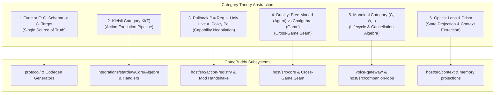

# 88 Category-Theoretic Core Architecture Optimization Specification

> **Status:** Superseded by `design/91_OPEN_GAMEPLAY_PIPELINE_RELEASE_IMPLEMENTATION_PLAN.md` for the generic protocol-codegen/category-runtime work described below. Do not implement that runtime; retain only independently production-owned architecture laws when their current owners adopt them.  
> **Applies to:** `host/` (Companion Host Core & Runtime), `integrations/stardew/` (SMAPI Mod Core & Execution Pipeline), `protocol/` (Bridge Protocol & Schemas), `packages/voice-protocol/` (Voice Lifecycle).  
> **Core Principle:** Apply Category Theory principles (Functorial Projections, Kleisli Effect Composition, Pullback Capability Negotiation, Coalgebra-Free Monad Duality, Monoidal Lifecycle FSM, and State Optics) to eliminate structural drift, decompose monolithic execution managers, formalize multi-timeline cancellation, and establish clean cross-game decoupling—while strictly obeying `AGENTS.md` (no heavy FP dependencies, zero over-engineering, deep modules, and default-deny authority).

---

## 1. Executive Summary & Problem Formulation

The GameBuddy companion architecture spans TypeScript (Host & Voice Gateway), C# (SMAPI Mod & Core Library), and heterogeneous protocols (Named Pipe, WebSocket, HTTP/SSE). As identified in [`CODEBASE_ARCHITECTURE_AND_RELEASE_AUDIT.md`](file:///E:/projects/ai-game-companion/docs/CODEBASE_ARCHITECTURE_AND_RELEASE_AUDIT.md), the system faces six fundamental structural challenges:

1. **Protocol & Contract Drift (Lack of Functorial SSOT):** Schema definitions are redundantly defined in JSON Schema (`protocol/bridge-v1.schema.json`), TypeScript DTOs/validators (`host/src/protocol.ts`), and C# models (`integrations/stardew/Core/Models/`), risking subtle bounds, nullability, and field mismatches across language boundaries.
2. **Monolithic Execution Manager (Missing Kleisli Decomposition):** [`ExecutionManager.cs`](file:///E:/projects/ai-game-companion/integrations/stardew/ExecutionManager.cs) (2,700+ lines) imperatively braids target discovery, prerequisite validation, game-thread dispatching, native mutation, postcondition observation, receipt synthesis, and error handling.
3. **Capability Drift (Informal Capability Negotiation):** Tripartite capability matching between Host Registry (`STARDEW_ACTION_REGISTRY`), Mod live capabilities (`ModLiveCapabilities`), and Player Policy is performed ad-hoc, previously leading to descriptor drift and unaligned validation sets.
4. **Agent-Game Authority Confusion (Missing Coalgebra-Free Monad Duality):** Coupling between the Host planning runtime and Stardew-specific types risks violating the core invariant that *model text is pure intent and never constitutes execution proof*.
5. **Multi-Timeline Asynchrony & Race Hazards (Missing Monoidal Cancellation Algebra):** Independent asynchronous timelines (Voice PTT, Dialogue Turns, Game Ticks) experience edge-case races (e.g., PTT cancel during the starting window, or chat runtime intent deadlocks) when cancellation fails to commute with initialization.
6. **State & Context Explosion (Missing State Optics):** Extracting LLM prompts from rich game snapshots and managing CAS memory revisions requires ad-hoc deep clones rather than composable functional projections.

By adopting Category Theory as a design discipline, we model these systems with mathematical precision and translate them into lightweight, native, zero-dependency C# and TypeScript implementations.

---

## 2. Mathematical Foundations & Architectural Mappings



---

### 2.1 Functorial Protocol Architecture ($\mathcal{C}_{\text{Protocol}} \xrightarrow{F} \mathcal{C}_{\text{Host}} \times \mathcal{C}_{\text{Mod}}$)

#### Mathematical Definition
Let $\mathcal{C}_{\text{Schema}}$ be the category whose objects are domain data types and whose morphisms are schema validators and transformations. We establish two structure-preserving Functors:
- $F_{\text{TS}}: \mathcal{C}_{\text{Schema}} \to \mathcal{C}_{\text{TypeScript}}$
- $F_{\text{CS}}: \mathcal{C}_{\text{Schema}} \to \mathcal{C}_{\text{C\#}}$

A serialization/deserialization mapping is a Natural Transformation $\alpha: F \Rightarrow \text{WireJson}$ such that for every domain morphism $f: A \to B$, the naturality square commutes:

$$\begin{matrix}
F(A) & \xrightarrow{\quad F(f) \quad} & F(B) \\
\alpha_A \downarrow & & \downarrow \alpha_B \\
\text{WireJson}(A) & \xrightarrow{\quad \text{WireJson}(f) \quad} & \text{WireJson}(B)
\end{matrix}$$

#### Concrete Architecture
1. **SSOT Protocol Schema (`protocol/schema/`)**: Single declarative schema for Bridge Messages, Requests, Receipts, and Evidence.
2. **Deterministic Functorial Codegen Tooling (`tools/generate-protocol.mjs`)**:
   - Compiles schema into TypeScript `type` declarations and pure validator predicates in `host/src/protocol.generated.ts`.
   - Compiles schema into C# `sealed record` types with `[JsonPropertyName]` attributes and `System.Text.Json` source generation in `integrations/stardew/Core/Protocol/Protocol.Generated.cs`.
3. **Naturality Invariant Tests**: Roundtrip fuzzing guarantees $\text{deserialize}(\text{serialize}(x)) \equiv x$ for all objects in the category.

---

### 2.2 Kleisli Action Execution Pipeline ($\mathbf{Kl}(T)$)

#### Mathematical Definition
Let $T$ be the Execution Monad combining Environment Reading, Game State Transformation, Failure Propagation, and Evidence Logging:
$$T(X) = \text{Reader}(\text{ActionEnv}) \to \text{State}(S_{\text{game}}) \to \text{Task}(\text{Result}(X \times \text{ReceiptEvidence}, \text{FailureReason}))$$

An atomic game action is an Arrow in the Kleisli Category $\mathbf{Kl}(T)$:
$$f: \text{ActionRequest} \to T(\text{ExecutionReceipt})$$

The complete lifecycle is a strict Kleisli composition of 5 orthogonal morphisms:
$$\text{Pipeline} = \text{BuildReceipt} \circ \text{ObservePostcondition} \circ \text{ExecuteNative} \circ \text{Revalidate} \circ \text{Discover}$$

```text
Request ──[ Discover ]──> Target ──[ Revalidate ]──> ValidatedTarget 
        ──[ ExecuteNative ]──> NativeResult ──[ ObservePostcondition ]──> Evidence 
        ──[ BuildReceipt ]──> ExecutionReceipt
```

#### Concrete Architecture
1. **Zero-Allocation Result Type (`integrations/stardew/Core/Algebra/Result.cs`)**:
   `readonly record struct Result<TValue, TError>` with `IsSuccess`, `Value`, `Error`, and `Bind`/`Map` combinators (no heavy FP library).
2. **Composable Step Interface (`integrations/stardew/Core/Abstractions/IStepHandler.cs`)**:
   Each semantic action (e.g. `TillSoilStepHandler`, `WaterCropStepHandler`, `EquipToolStepHandler`) implements independent, pure stages.
3. **Execution Manager as Arrow Composer (`integrations/stardew/Core/Algebra/ActionPipelineComposer.cs`)**:
   Replaces the 2,700-line `ExecutionManager.cs`. It handles game-thread synchronization (`Game1.player`), deadline timeouts, and failure short-circuiting while delegating domain specifics to isolated step handlers.

---

### 2.3 Pullback Capability Negotiation ($\text{Reg} \times_{\text{Univ}} \text{Live} \times_{\text{Univ}} \text{Policy}$)

#### Mathematical Definition
Let $\mathbf{CapSet}$ be the category of capability sets and subset inclusions.
Given:
- $R \hookrightarrow U$: Host Published Action Registry
- $L \hookrightarrow U$: Mod Live Verified Capabilities
- $P \hookrightarrow U$: Player Security Policy (Default-Deny)

The active tool surface $\mathbf{ActiveActions}$ is the categorical **Pullback (Limit)** over the universal capability space $U$:

$$\begin{matrix}
\mathbf{ActiveActions} & \xrightarrow{\quad \pi_1 \quad} & L \\
\pi_2 \downarrow & \lrcorner & \downarrow \\
R \cap P & \xrightarrow{\quad \quad} & U
\end{matrix}$$

By the Universal Property of Pullbacks:
$$a \in \mathbf{ActiveActions} \iff a \in R \land a \in L \land a \in P$$

#### Concrete Architecture
1. **Handshake Pullback Resolver (`host/src/capability-pullback.ts` & C# `FarmhandCapabilitySurface.cs`)**:
   During bridge attachment, Mod sends its `liveCapabilities: readonly string[]`. Host evaluates the pullback against `STARDEW_ACTION_REGISTRY` and current `ActionPolicy`.
2. **Soundness Invariant**: An action is materialized into LLM Tool definitions *if and only if* it belongs to the pullback set. Unverified, disabled, or unacknowledged actions are strictly impossible to invoke.

---

### 2.4 Coalgebraic Observation & Free Monad Intent Duality ($L \dashv R$)

#### Mathematical Definition
- **Game Engine as $F$-Coalgebra**:
  The running game is a transition system unfolding structured observations:
  $$\alpha: S_{\text{game}} \to \text{ObservationSnapshot} \times (\text{ActionCommand} \to S_{\text{game}})$$
- **Agent Planner as Free Monad**:
  The LLM generates symbolic AST trees in $\text{Free}(\mathcal{F}_{\text{Action}})$, representing pure uninterpreted intents:
  $$\text{Free}(F)(X) = \text{Pure}(X) \mid \text{Roll}(F(\text{Free}(F)(X)))$$
- **Adjunction & Counit Evaluation ($\varepsilon$)**:
  The Mod acts as the unique Evaluator (Counit $\varepsilon: \text{Free}(\mathcal{F}) \to \text{StateTransformer}$), folding the AST into authoritative game state transitions.

#### Concrete Architecture
1. **Cross-Game Core Abstraction (`host/src/core/`)**:
   Host Core depends exclusively on generic `GameCoalgebra<TObservation, TCommand>` and `ActionAstPipeline`. It contains **zero references** to `Stardew`, `SMAPI`, `Farmer`, or `Tile`.
2. **Game Integration Adapter (`integrations/stardew/`)**:
   Provides concrete instances of the Coalgebra observer and the Counit interpreter. Adding a new game (e.g. Minecraft, Terraria) requires writing only an integration adapter without modifying Host Core.

---

### 2.5 Monoidal Lifecycle & Cancellation Algebra ($(\mathcal{C}, \otimes, I)$)

#### Mathematical Definition
Concurrent subsystems (Voice PTT, Dialogue Director, Game Actions) form a Symmetric Monoidal Category where parallel execution is modeled by tensor products $A \otimes B$.

To guarantee safety across asynchronous boundaries, Lifecycle FSM transitions must satisfy **Cancellation Absorption and Distributivity**:
$$\text{Cancel} \circ \text{Starting}(t) \equiv \text{Aborted}(t)$$
$$\text{Cancel} \circ (\text{Action}_1 \otimes \text{Action}_2) \equiv (\text{Cancel} \circ \text{Action}_1) \otimes (\text{Cancel} \circ \text{Action}_2)$$

#### Concrete Architecture
1. **Linearized Starting-Window FSM (`packages/voice-protocol/` & `voice-gateway/`)**:
   State transitions (`Uninitialized` $\to$ `Starting` $\to$ `Active` $\to$ `Draining` $\to$ `Terminal`) use atomic cancellation barriers. A cancel received in `Starting` instantly transitions to `Terminal` and cancels underlying child process spawns/temp dir allocations before they become active.
2. **Epoch Interruption Barrier (`host/src/action-execution-coordinator.internal.ts`)**:
   Action batches execute under an explicit `epoch: number`. Any turn interruption invalidates the epoch, forcing in-flight Kleisli steps to fail closed with `epoch_cancelled`.

---

### 2.6 State Optics & Interaction Memory Projections (Lenses & Prisms)

#### Mathematical Definition
A **Lens** $l: \text{Lens}\langle S, A\rangle$ provides composable, non-destructive sub-state focus:
$$\text{get}: S \to A, \quad \text{set}: S \times A \to S$$
satisfying the standard Lens laws (Get-Put, Put-Get, Put-Put).

#### Concrete Architecture
1. **Snapshot Context Projectors (`host/src/context/snapshot-lens.ts`)**:
   Instead of serializing the full 50KB GameSnapshot into every prompt turn, specialized lenses (`inventoryLens`, `locationLens`, `surroundingsLens`) extract minimal sub-structures.
2. **Memory CAS Monoid (`host/src/memory/memory-monoid.ts`)**:
   Memory journals and continuity state transitions are modeled as Free Monoids with monotonic revision CAS checks, preventing state corruption or cross-continuity contamination.

---

## 3. Strict Compliance with Repository Invariants (`AGENTS.md`)

| Invariant | How Category-Theoretic Optimization Complies |
|---|---|
| **No Over-Engineering & Simplest Implementation** | Implemented using native TypeScript Discriminated Unions and C# `readonly record struct Result<TValue, TError>`. No `fp-ts`, `LanguageExt`, or heavy third-party FP dependencies. |
| **Deep Modules & Clear Interfaces** | Replaces 2,700-line monolithic classes with deep modules having small interfaces (`IStepHandler`, `IActionPipelineComposer`, `ICapabilityPullback`). |
| **No Defensive Ritualistic Validation** | Removes redundant SHA256 string hashing and token scraping; replaces them with formal Equalizers over native typed projections. |
| **Fail-Closed & Default-Deny Authority** | Mod remains the sole execution authority. Pullback guarantees unapproved actions cannot be executed. |
| **Step-Boundary Preservation** | Kleisli composition records exact step receipts and failure indices; partial state mutations are never masked. |

---

## 4. Verification & Quality Gates

1. **Test-Driven Development (TDD)**: Every task follows strict Red $\to$ Green $\to$ Refactor loops at well-defined public seams.
2. **Property-Based Testing (PBT)**:
   - TypeScript: `fast-check` for Functor roundtrips, Lens laws, and AST serialization.
   - C#: `FsCheck.Xunit` / generator theories for Kleisli associativity, Result monad laws, and Pipeline short-circuit invariants.
3. **Architecture Boundary Tests**:
   - Verify `host/src/core` has zero imports of Stardew-specific models or protocols.
   - Verify zero unhandled exceptions escape the SMAPI step runner to the main game loop.
