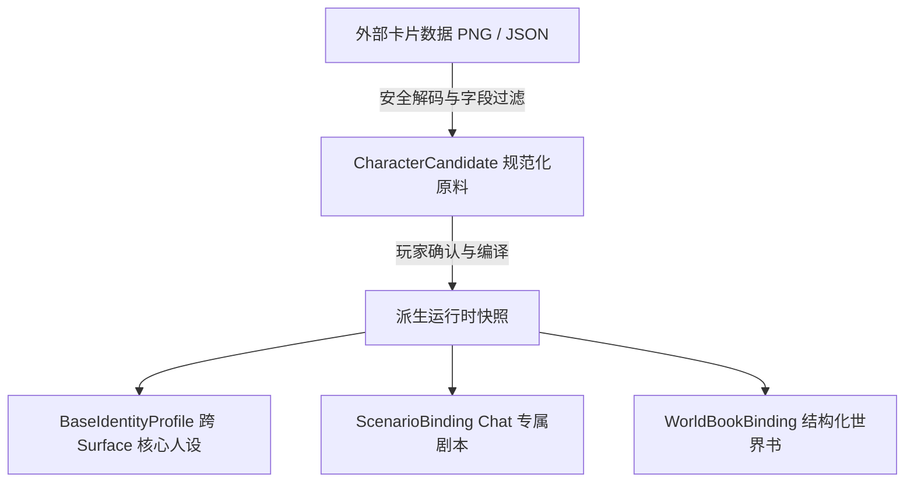
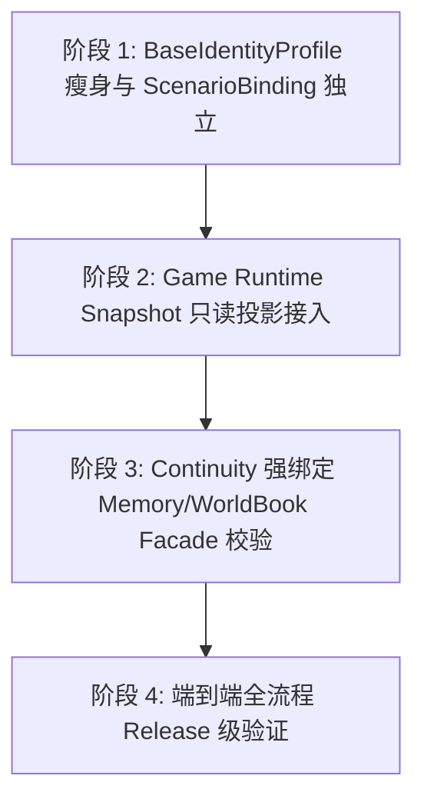

# Context、长期记忆与世界书（Lorebook）现代化架构设计规范

## 1. 架构目标与存储所有权边界

本规范定义 GameBuddy 在多表面（Chat 与 Game）、多模态交互下的 Context 分层物化、长期记忆生命周期以及世界书（WorldBook / Lorebook）检索与接入标准。

### 1.1 存储所有权边界（Storage Ownership Boundaries）
- **Host 调度层**：
  - 管理 Host-owned 存储资产（包括 `ChatThreadStore` SQLite WAL、World Info JSON、Profile 资产及审核归档）；
  - **绝不直接读写 Magic Context-owned SQLite 内部表**；仅通过受控的 typed facade 和 canonical immutable snapshot 进行交互。Host 也不直接写 `m[1]` 或拼接 prompt。
- **Magic Context 扩展层**：
  - 拥有长期 Memory SQLite 存储、Continuity 数据分区、`m[0]/m[1]/raw tail` 原生物化以及 Decay Compartment 折叠。
- **游戏集成层（Stardew Integration）**：
  - 拥有游戏主线程真实状态（Live World Snapshot）、动作执行（Execution Receipt）与已发布能力集（Capability Set）的唯一权威。

---

## 2. Context 四轨分层拓扑与物化契约

```
┌────────────────────────────────────────────────────────────────────────────────────────────────────────┐
│                                 Context 四轨动静隔离拓扑架构                                             │
├───────────────────┬──────────────────────────────────┬─────────────────────────────────────────────────┤
│ 区域层次          │ 聊天表面 (Chat Surface / 酒馆)   │ 游戏表面 (Game Surface / 伴侣)                   │
├───────────────────┼──────────────────────────────────┼─────────────────────────────────────────────────┤
│ 1. 恒定系统层     │ • 跨 surface 基础人设             │ • 跨 surface 基础人设                           │
│    (System Prompt)│   (BaseIdentityProfile)          │   (BaseIdentityProfile)                         │
│                   │ • 纯净语言口吻与基础表达风格     │ • 具身伴侣动作与协作指引                        │
│                   │   (同一 Profile Revision 字节稳定)│   (同一 Profile Revision 字节稳定)              │
├───────────────────┼──────────────────────────────────┼─────────────────────────────────────────────────┤
│ 2. 累计冷区基线   │ • 玩家画像 (UserPersona)         │ • 共同长期记忆 (Semantic Memory / Episode)      │
│    (m[0] Baseline)│ • 酒馆专属剧本 (ScenarioBinding) │ • 经审核常驻世界常识 (Always-on WorldBook)      │
│                   │ • 共同长期记忆 (Semantic Memory) │ • 衰减历史折叠 (Decay Compartments)             │
│                   │ • 衰减历史折叠 (Decay Compartments)  (当前 Materialization 周期内逐字重放)         │
├───────────────────┼──────────────────────────────────┼─────────────────────────────────────────────────┤
│ 3. 易变增量层     │ • 未折叠全量历史块 (New Compartments)                                              │
│    (m[1] Delta)   │ • 本会话新增记忆增量 (Memory Mutations)                                           │
│                   │ • 稳定源 replacement / tombstone 标记 (带单调 sequence cursor)                   │
├───────────────────┼──────────────────────────────────┼─────────────────────────────────────────────────┤
│ 4. 实时热区尾部   │ • 最近有界原始对话 (Raw Turns)   │ • 游戏快照只读投影 (Snapshot Projection)        │
│    (raw tail 末端)│ • 玩家当前输入                   │ • 最近交互历史 + 玩家当前输入                   │
└───────────────────┴──────────────────────────────────┴─────────────────────────────────────────────────┘
```

### 2.1 各层生命周期与前缀缓存（Prefix Cache）契约
- **前缀缓存版本语义**：前缀缓存严格对 **“同一 Revision / Materialization 周期内前缀完全一致的请求”** 保证命中。当发生 HARD Materialization、剧本变更或记忆折叠时，Revision 递增并重算基线。
- **Tier 1: 恒定系统层 (System Prompt)**
  - 存放经审查的 `BaseIdentityProfile`（仅含名字、角色定位、核心性格）。严格禁止将长篇剧情或无界卡片全量倾倒入 System Prompt。
- **Tier 2: 累计冷区基线 (`m[0]`)**
  - **Chat 表面**：物化 `UserPersona`、`ScenarioBinding`、预算内的 `DialogueExamples` 以及已衰减折叠的 `Decay Compartments`；
  - **Game 表面**：物化同一 Continuity 下获批的长期记忆（`SEMANTIC_MEMORY` / `INTERACTION_EPISODE`）及常驻世界常识；**严格物理剔除 `ScenarioBinding`**。
- **Tier 3: 易变增量层 (`m[1]`)**
  - **内容**：自上次 `m[0]` 生成以来的全保真新历史块、新记忆增量以及稳定源的 replacement / tombstone 变更；
  - **生命周期**：由 Magic Context materializer 管理，带单调 `cursor` 线性化；当触发 context pressure 阈值或合法 HARD 条件时，由 decay renderer 压缩折叠进 `m[0]` 并重置 `m[1]`。
- **Tier 4: 实时热区尾部 (`raw tail`)**
  - **Chat 表面**：最近未折叠的原始消息轮次与当前玩家输入；
  - **Game 表面**：由最新真实游戏快照派生的**只读上下文投影（Snapshot Context Projection）**与当前玩家输入。

---

## 3. 角色卡导入、Scenario 物理隔离与 Profile 分层

### 3.1 规范化 Candidate 归档与运行时 Snapshot 派生
遵循安全准入标准，导入器（`st-card-import.ts` 与 `StCardImportService`）**仅持久化经严格审查和类型约束的规范化 Candidate 与审计报告**，绝不持久化未经沙盒化的不可信原始源文件、宏或可执行扩展：



### 3.2 Scenario 与 Profile 严格物理隔离
为了防止酒馆虚构剧本污染星露谷客观世界，执行严格的跨 Surface 隔离规范：

1. **`BaseIdentityProfile`（跨 Surface 共享）**：
   - 仅包含 `name`、`role`、`core disposition`、`interactionStyle`、`expressionStyle`；
   - **严禁将 `scenario` 写入 `identity.continuity` 或基础人设**。
2. **`ScenarioBinding`（Chat 专属）**：
   - 独立持有 `scenarioId`、`revision`、`content`、`provenance`；
   - 仅在组装 `ChatProfileSnapshot` 时作为 Chat-only 稳定源注入；
3. **`GameProfileSnapshot`（Game 专属）**：
   - 仅挂载 `BaseIdentityProfile` 与具身动作指引；
   - **从数据源输入端物理排除 `ScenarioBinding`**，绝不在 Game 中发送“请忽略虚构剧本”等软提示。

---

## 4. WorldBook 架构所有权与查询接入规范

### 4.1 所有权与数据流
- **独立所有权**：World Info（世界书）保持独立的 Host 侧文件存储与版本管理，**不迁入 Magic Context SQLite 内部表**；
- **只读快照物化**：Host 依据经过审查的 WorldBook 产生不可变的 `WorldBookBinding`（显式携带 `continuityId`、`worldBookId`、`revision` 与 `canonicalHash`），Magic Context 通过 typed source / render extension 将其 always-on premise 消费并物化至 `m[0]`。

### 4.2 显式查询与自动召回协同
- **显式查询工具（`companion_worldbook_catalog` / `companion_worldbook_query`）**：
  - 保留作为精确词条检索与受控 lookup 的已发布工具能力；
- **Continuity 作用域自动召回扩展（Recall Extension）**：
  - 必须由 Magic Context 内部实现，且严格限定在当前 `manifest-derived continuity identity` 分区内执行；
  - **Fail-Closed 容错契约**：
    - *可选召回超时 / 服务暂不可用*：安全降级为空召回片段；
    - *数据损坏、continuityId 不匹配、Profile revision / hash 不匹配*：**必须 Fail-Closed 终止当前 materialization**，绝不允许静默回退到过期数据或替代内容。

### 4.3 当前状态：stable WorldBook binding 与 per-turn selective Lorebook（Task 6）

**稳定 binding 不变。** 现有 always-on WorldBook / World Info path（`lorebook_constant` / always-on premise）继续由 Host 提供 canonical `WorldBookBinding` snapshot，经 typed source / render extension 进入稳定 `m[0]`，不改为 selective `m[1]`。

**Task 6 的 release-candidate 边界。** per-turn selective Lorebook 的选择输入仅限 accepted player text 与 existing bounded visible tail，产出 deterministic 的 reference-only durable turn plan；该轮 `m[1]` 只由 Magic Context 自己既有的 context extension/materialization pipeline 物化。Task 6 是一个独立的 release-candidate capability，不是 Chat Core 的 blocker；Chat Core 的通过也不自动包含 selective Lorebook claim，后者只由 Task 6 gate 决定。

**只补通用 pipeline contract。** Task 6 必须复用 Magic Context 已有的 context extension/materialization pipeline；若该 pipeline 缺少把 immutable turn input / contributor source（包括 reference-only plan）交给原生 materializer 的 contract，只补这个可供不同 source 复用的通用 contributor/source contract。不得为 Lorebook、Memory、Game 或其它单一领域各建专用 `m[1]` injection API、install API 或 mutator。

- **Host**：继续拥有 canonical World Info、revision/hash、selection 输入与 deterministic reference-only plan，满足 durable-before-provider 与 replay；
- **ChatThreadStore**：只存 `durableTurnId`、refs、revision/hash/order/provenance，不存正文；
- **provider / replay**：只消费 plan，不重新扫描或选择；
- **Magic Context**：拥有 source validation、`m[1]` materialization / lifecycle / cache / cursor / fold / replay / cleanup，并是唯一能写入其 SQLite 的 owner。

**外部写入禁止。** Host、provider 或任何 Magic Context 外部 caller 都不得直接写 `m[1]`、拼接 Host prompt 或写 Magic Context-owned SQLite；也不以一个 Lorebook 专用的外部 mutator 代替 native pipeline。缺少通用 contributor/source contract 时，Task 6 的 scoped claim 保持未通过并 fail closed，不实现 Host fallback。

**SillyTavern 参考边界。** 官方 World Info 在每轮 prompt build / generation 时扫描并注入；其 regex、recursion、probability、timed effects、多种 placement 等超出 Task 6，不复制。这里只采纳「由 context/prompt owner 在本轮构建时处理」的运行模型。

**release 处置。** Task 5（stable binding 的 release slice）使用 next-accept activation barrier，与本现状解耦；Task 6 只有在其通用 pipeline contract、embedded GameBuddy-owned runtime acceptance 与规定的 live evidence gate 全部闭合后，才能发布 selective Lorebook claim。任一缺失只阻断该 scoped claim，不把 Chat Core 或整个 Chat/Tavern release 改写为 blocked/deferred；禁止 stable `m[0]` fallback 或 prompt 拼接。详见[选择性 Lorebook Task 6 计划](../tasks/active/chat-selective-lorebook-m1.md)。

---

## 5. 游戏实时世界状态（Live World）接入协议

### 5.1 运行时只读上下文投影（Snapshot Context Projection）
Game runtime 在每个交互轮次开始时，从当前活跃的 Mod 连接中读取权威的 `StardewFarmhandSnapshot`，并通过已有的纯投影函数（`projectMovementContext`、`projectFarmingContext`、`projectInventoryContext`）生成有界只读投影，置于 `raw tail` 最末端：

```text
[Game Snapshot Projection:
- Snapshot Revision: #1042 (Sampled: 120ms ago)
- Location: UndergroundMine (Floor 45), Tile: (18, 24), Actionable: true
- Farming: Stamina=75/100, SoilTiles=0, CanWater=false
- Tools: Slots=12, Equipped=Obsidian Edge]
```

### 5.2 权威性与安全边界
1. **非授权性（Non-Authoritative for Actions）**：
   - 投影仅供大模型时空感知与语境理解；
   - 所有物理动作的执行准入（Admission）、前置条件重验与后置证据（Receipt），**必须在游戏主线程上基于新鲜状态独立执行**，绝不将 Prompt 投影视为行动成功的凭证。
2. **工具面严格收敛**：
   - 仅暴露 Mod 实际发布的限制性能力交集（`stardew_observe`、`stardew_execution_status`、`stardew_interaction_catalog` 及已发布动作工具）；严禁在架构中假定或暴露未实现的虚构工具。
3. **故障降级**：
   - 若当前 Mod 连接断开或快照不可读，输出有界占位 `[Game Snapshot Unavailable]`，绝不伪造虚构事实。

---

## 6. Continuity 与 Profile 强绑定契约

所有跨组件边界交互必须携带强类型凭证：
1. **Memory Facade 绑定**：
   - `GameBuddyPlayerMemoryCrudFacade` 必须同时显式校验 `continuityId`、`profileId` 与 `profileRevision`，不匹配则拒绝操作；
2. **WorldBook 与 Scenario 绑定**：
   - `WorldBookBinding` 与 `ScenarioBinding` 必须显式携带 `continuityId` 与 `canonicalHash`，由运行时 resolver 进行签名比对，确保跨 surface 状态 100% 隔离且一致。

---

## 7. 实施与演进路线



1. **阶段 1：`BaseIdentityProfile` 瘦身与 `ScenarioBinding` 独立**
   - 在代码仓库的 `host/src/identity-profile.ts` 中剥离 `continuity` 中的剧本内容；
   - 建立独立的 `ScenarioBinding` 类型与 Chat 专属物化路径；
   - 升级 `st-card-import.ts` 实现 Candidate 规范化归档与 Surface 快照派生。
2. **阶段 2：Game Runtime Snapshot 只读投影接入**
   - 在 Game runtime 交互轮次中接入 `snapshot-projection.ts`，生成带 `snapshotRevision` 的只读 `raw tail` 投影。
3. **阶段 3：Continuity 强绑定 Memory/WorldBook Facade 校验**
   - 扩展 `GameBuddyPlayerMemoryCrudFacade` 与 `WorldBookBinding` 的 `continuityId` / `profileRevision` / `hash` 校验。
4. **阶段 4：端到端全流程 Release 级验证**
   - 导入真实角色卡，验证 Chat 剧本在 Game 中被彻底物理排除，且游戏实时投影与前缀缓存均符合预期。
