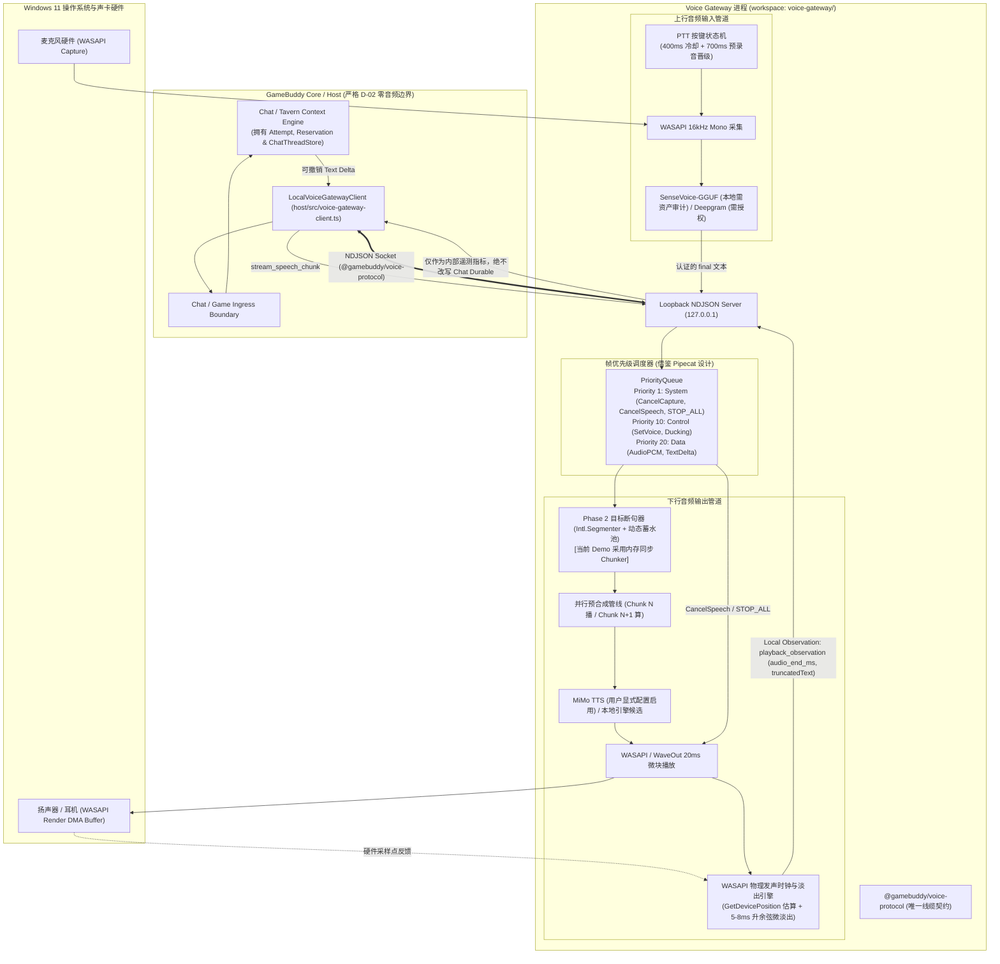

# 全双工流式音频网关长远架构演进提案（Phase 2 Proposal）

> **【审查冻结与状态声明（Review Governance Statement）】**  
> **当前状态：`draft / 协议切片 1 已冻结（Slice 1 Protocol Frozen）/ not implementation-ready for the full streaming stack`。**  
> 1. **非生产依据**：本文属于 **Phase 2 全双工流式音频长远演进提案（Future Architectural Horizon）**，作为技术调研与架构设计储备，**不构成当前 v1 PTT Voice Gateway 的实现要求，亦绝不作为当前阶段任何 release gate、production gate 或 Chat/Game/Desktop 的准出依据**。  
> 2. **当前生产与已验证基线（Current Verified Baseline）**：当前生产路径严格锁定为 [`packages/voice-protocol`](file:///E:/projects/ai-game-companion/packages/voice-protocol/)（v1 PTT 线缆协议）与 [`voice-gateway/`](file:///E:/projects/ai-game-companion/voice-gateway/)（受管 PTT 批处理网关），其静态与局部集成验证（`deterministic/integration verified`）由 [`design/domains/voice/overview.md`](overview.md) 权威拥有。  
> 3. **协议演进约束**：本文 §7 的 v2 线缆契约草案已按 [`voice-gateway-streaming-submodule.md`](../tasks/active/voice-gateway-streaming-submodule.md) Slice 1 完成冻结，**权威实现位于 [`packages/voice-protocol/src/v2.ts`](file:///E:/projects/ai-game-companion/packages/voice-protocol/src/v2.ts)，本文 §7 仅作历史草案与设计意图参考，不再作为线缆契约的代码形态依据**。在协议实现同步完成前，严禁对现行 v1 代码进行破坏性替换。
> 4. **宿主侧流式接线已落地（Implementation Update，2026-09-19）**：Slice 5 的 Chat delta → Voice 流式朗读生产接线已完成（`ChatVoiceSpeechPublisher` + `createChatVoiceStreamingSink()` + `runMountedProviderStart` speechSink 分发，详见任务文档 Slice 5 第 3 节），并严格遵守 §1.1 硬不变量——`raw Chat token delta ≠ admissible speech expression`：delta 仅在既有 presentation admission（`canPreviewNativeContent`）通过后、与浏览器预览同源分发；语音 job 由 healthy Voice client 的 epoch 与 v2 线缆门控，Host-owned、surface-scoped、epoch-bound。**注**：此接线属 Phase 2 落地证据，不改变本文 `draft / not implementation-ready for the full streaming stack` 状态；完整流式栈（L4 输入链路制造、L5 玩家级门禁）仍未实施。

---

## 1. 架构定位、职责划分与 Authority 边界

### 1.1 系统定位与 D-02 解耦契约
遵循 GameBuddy 核心解耦决策（`chat-tavern-context-engine-decoupling.md` D-02）以及 Voice 领域原则（[`overview.md`](overview.md)）：
1. **Core 零音频语义（Zero-Audio Core）**：
   - GameBuddy Core（Host）严格作为**装配根（Composition Root）、受管入口认证者与产品生命周期持有者**，不承载任何音频编解码、声卡驱动封装、PCM 帧切片、DSP 降噪或 AEC 回声消除语义。
   - Core 与 Voice Gateway 之间仅通过受管本地环回 IPC（`127.0.0.1` 环回 Socket，NDJSON 协议）进行交互。
   - **输入端**：Core 仅接收经过网关认证的最终转写文本（`FinalVoiceInput`），进入与键盘输入同等的 Chat/Game Ingress 边界；部分文本预览（Partial transcript）仅供 UI 呈现，不能作为持久事实或触发 Agent 推理。
   - **输出端严格准入（Hard Invariant）**：**`raw Chat token delta ≠ admissible speech expression`**。Phase 2 演进中，绝对不得由普通 token delta 直接在网关创建语音 job；任何 speech expression 必须先经过 Host/runtime-owned、surface-scoped、epoch-bound 的 presentation admission。
2. **独立进程与仓储边界（Process & Workspace Boundary）与 Submodule 演进路线**：
   - **当前形态（In-tree Workspace Packages）**：语音服务当前作为主仓库内的独立工作区包 [`voice-gateway/`](file:///E:/projects/ai-game-companion/voice-gateway/)（Sidecar 独立进程网关）与 [`packages/voice-protocol/`](file:///E:/projects/ai-game-companion/packages/voice-protocol/)（线缆协议与编解码抽象）承载，严禁在架构文档中使用不存在的虚拟路径（如 `vendor/voice-gateway`）。
   - **零侵入物理隔离**：得益于 D-02 契约，Host Core 与 Gateway 之间仅通过受管本地环回 IPC（`127.0.0.1` 环回 Socket，NDJSON 协议）进行交互，Core 保持绝对零音频依赖。因此 Gateway 在逻辑和物理上已具备完全自包含的独立服务属性。
   - **未来 Git Submodule / 独立 Repo 演进触发条件**：
     - 当前阶段（v1 PTT 与 v2 协议冻结）保留在主仓内以利用 pnpm workspace 保持零摩擦类型检查与 CI 验证；
     - 若未来 Phase 2 全双工流式演进引入了重度原生编译依赖（如 WebRTC AEC3 原生 C++ 动态库、特定平台 WASAPI 驱动绑定、或独立的 Python/Rust 模型服务），导致主仓构建链与环境异构化，则触发正式拆分为独立 Git 仓库（如 `zhexulong/gamebuddy-voice-gateway`），并以类似 `vendor/magic-context` 的形式通过 Git Submodule 挂载到主仓。
     - 届时必须完成显式的 Submodule 拆分提案、登记固定 Commit 哈希（pinned commit）、并建立双向 CI 验证流水线。
   - 语音进程的崩溃、GC 停顿、重连或冷启动绝不能阻塞 Host 主进程、Chat 会话或游戏主循环。

### 1.2 跨领域 Authority 严格隔离（三项红线绝对封冻）

#### (1) Voice 严禁越权修改 Chat Durable State（红线 1 确认）
- **所有权属于 Chat**：Chat 领域独占会话历史、`ChatThreadStore`、`attemptId`、`cancelEpoch`、presentation reservation、durable commit 与 read-back 完整流程。
- **Voice 仅提供局部观察（Local Observation）**：网关在音频打断时计算的物理时钟 `audio_end_ms` 与时间戳截断文本 `truncatedText`，严格定义为 **Voice-local playback observation（语音播放层观测指标）**。
- **严禁反向写权限**：网关或 Host Voice Client **绝对无权直接截断、修改或写回 `ChatThreadStore`**，亦不得单方面向消息附加 `interrupted=true`。
- 若产品未来需要将“玩家实际听到的文本范围”记入对话历史，必须由 Chat owner 依据明确的 presentation reservation、CAS 锁、版本校验与 attempt 绑定在 Chat 内部完成。任何延迟到达、无 reservation、跨 epoch、turn 不匹配的语音事件一律 **fail closed（静默忽略或丢弃）**。

#### (2) Voice 严禁越权判定或取消 Game Action（红线 2 确认）
- **所有权属于 Game**：游戏动作（Game Action）的调度、可逆性、native seam 承接、receipt 确认、postcondition 检验与 unknown 状态均由 Game owner 独占管理。
- **自然语音打断不是 Game Cancel**：玩家在助手讲话时的自然插话（Barge-in）绝非经过鉴权的 `/stop` 或 `/redirect` 指令，**绝对不得自动触发任何 Game Action 的 `abort()`**。
- **职责隔离**：语音层的 `CancelSpeech` 只能且必须仅用于停止 Voice-owned 的麦克风采集、TTS 合成、语音排队与扬声器硬件发声；彻底删除 Voice 侧关于 `cancelOnInterruption` 的动作分类元数据；严禁通过语音帧队列路由或持久化 Game Action 结果。

#### (3) 范围分层：当前 Demo 范围 vs Phase 2 未来提案（红线 3 确认）

| 架构维度 | Phase 1：当前 Demo 范围（已集成验证基线）| Phase 2：长远演进提案（本文描述的技术愿景）|
| :--- | :--- | :--- |
| **交互模式** | **受管 Push-To-Talk（可见按键说话）** | 免提持续监听（Hands-free OpenMic）|
| **语音检测** | 按键状态机驱动（Press/Release/Tail） | 持续 Silero VAD 动态端点检测（Endpointing） |
| **声学前处理** | 单通道麦克风捕获，降噪可选 | WebRTC AEC3 实时环回抵消（消除游戏背景音） |
| **停止语义** | 独立的 `CancelCapture`、`CancelSpeech`、`STOP_ALL` | 毫秒级自适应打断（Adaptive Barge-in） |
| **打断影响** | 仅清空当前 TTS 播放缓冲，截断通知仅作内部遥测 | 物理时钟与词表投影（仅作 Voice 局部观测） |
| **用户授权** | 默认本地处理；云端需显式同意与 provider 披露 | 必须具备显式常驻麦克风捕获与系统音频环回授权 |
| **当前实现状态** | **当前聚焦的稳定生产基线** | **独立 Proposal 储备，当前处于 design-blocked** |

---

## 2. 全局拓扑与数据流架构

系统分为三大平面：**Host 契约控制面**、**Voice Gateway 引擎调度面**、**本地硬件与声学 DSP 物理面**。



---

## 3. 流式处理管线与优先级调度（借鉴 Pipecat 设计）

### 3.1 三类帧体系与调度隔离
Voice Gateway 内部引入借鉴 Pipecat 的强类型 `Frame` 调度模型，但**严格剥离所有 Game Action 语义**：

1. **`SystemFrame`（Priority = 1）**：
   - 包含：`CancelSpeechFrame`、`CancelCaptureFrame`、`StopAllFrame`、`HardwareFaultFrame`。
   - **调度特性**：跳过普通数据队列，由专职协程（`__input_task`）立即同步执行。当收到 `CancelSpeech` 时，在 1ms 内向底层声卡发出静音信号。
2. **`ControlFrame`（Priority = 10）**：
   - 包含：`SetVoiceProfileFrame`、`SetAudioDuckingFrame`、`FlushPipelineFrame`。
   - **调度特性**：打断发生时自动被清理或重置。
3. **`DataFrame`（Priority = 20）**：
   - 包含：`AudioPCMChunkFrame`、`AssistantTokenDeltaFrame`、`TTSAudioChunkFrame`。
   - **调度特性**：打断发生时被丢弃；队列排空（`FrameQueue.reset()`）算法清理所有未播放的待发声帧。

### 3.2 停止语义与非阻塞降级
依据 [`overview.md`](overview.md)，网关严格支持三层独立停止语义，三者绝不互相伪装：
- **`CancelCapture`**：仅停止麦克风录音采集与 ASR 计算，丢弃未完成转写。
- **`CancelSpeech`**：仅停止当前 TTS 合成与声卡物理播放，清空音频输出队列。
- **`STOP_ALL`**：幂等收束当前网关的采集、合成、播放和所有等待队列。

**服从 `product-surfaces.md` 的生命周期**：
Voice 模块的任何错误、退出或重连**只撤销语音通道权限**，绝对不终止 Player Host，绝对不关闭独立 Chat，绝对不取消已被 Game owner 接受的动作。产品无感降级为纯文字交互。

---

## 4. 轮次控制与输入状态机（借鉴 Pi & LiveKit）

### 4.1 Phase 1（当前 Demo）：双轨按键状态机（Hold-to-Talk）
为提供流畅的按键说话体验，移植 `codexstar/pi-listen` 的生产级状态机逻辑：
1. **打字冷却守卫（`TYPING_COOLDOWN_MS = 400ms`）**：
   检测到用户正在键盘键入文字时，忽略空格键或其他说话热键的长按判定，防止编码或打字过程中误触发录音浮岛。
2. **预录音无缝晋级（Pre-recording Promotion）**：
   - 按下按键进入 Warmup（700ms 阈值）时，底层音频采集静默启动并开始缓存；
   - 达到阈值确立长按意图时，预录音流无缝“晋级”（Promote）为正式 ASR 任务，**彻底消除冷启动导致的句首吞字**；
   - 若在 700ms 内释放按键，则视为普通键盘敲击，静默丢弃预录音频。
3. **尾随延时（Tail Recording = 1200ms）**：
   按键松开后维持 1.2 秒的尾部吸附，吸收口语末尾音节；若在延时内再次按下，无缝合并为同一语音输入段。

### 4.2 Phase 2（未来提案）：全双工 OpenMic、STT 门控与 Backchannel 过滤
> **注意**：本小节属于 Phase 2 演进技术储备，当前 Phase 1 阶段不作为发布门禁要求。

在未来免提全双工场景下：
1. **STT 门控（Transcript Gate）**：伴侣说话时，麦克风捕获的玩家语音转写先暂存在 `_transcript_buffer`，不直接触发新轮次。
2. **Backchannel 保护带**：伴侣刚开口 1.0s 与即将说毕前 0.8s 强制为硬打断；其余时间短促助词（“嗯”、“对”）判定为语气附和并静默丢弃。
3. **假打断软暂停与恢复（`resume_false_interruption`）**：检测到轻微干扰时进入 1.5s 软暂停，若后续未检出有效输入，声卡自动恢复播放，避免咳嗽打断报点。

---

## 5. 声学物理时钟、PCM 契约与防爆音微淡出

### 5.1 显式 PCM 格式契约
当前代码固定在 16 kHz 单声道，为防止多格式混杂导致声卡崩溃，定义严格的格式元数据：
- **上行采集流（Capture Stream）**：显式声明为 `16000 Hz, 1 Channel, Signed 16-bit Little-Endian (pcm_s16le)`。
- **下行渲染流（Render Stream）**：TTS 提供者必须在元数据中显式声明输出规格（例如 16000 Hz 或 24000 Hz pcm_s16le）。若声卡硬件端点（Endpoint）仅支持 48 kHz，由网关内部重采样器（Resampler）显式执行采样率转换，禁止裸数据硬喂。
- **缺失即不确定（Fail to Uncertain）**：音频流缺失格式头或重采样失败时，状态置为 `uncertain` 并记录诊断日志，严禁盲目播放。

### 5.2 WASAPI 物理发声时钟估算（Voice-Local Observation）
当收到 `CancelSpeech` 信号时，网关通过硬件采样点反推真实发声时间：

$$\Delta t_{\text{effective\_played}} = \frac{\text{GetDevicePosition}() - \text{device\_position\_at\_start}}{\text{RenderSampleRate}} - \Delta t_{\text{driver\_dma\_delay}}$$

$$\text{audio\_end\_ms} = \max\left(0, \; \Delta t_{\text{effective\_played}} \times 1000\right)$$

- **词表对齐与迟滞判定**：
  若 TTS 产出携带词级时间戳，对被打断的边缘单词 $W_k$ 计算听觉比例。发声比例 $\ge 65\%$ 或已播 $\ge 120\text{ms}$ 者保留，其余剔除，生成带 `...[被打断]` 的 `truncatedText`。**若缺少 provider timing 或文本对应映射，必须返回 `uncertain`，严禁猜测或伪造听见文本**。
- **权威性约束**：该文本由网关在 `playback_observation` 事件中上报，**仅用于客户端 UI 弱提示或遥测监控**，绝不作为改写 `ChatThreadStore` 的指令。

### 5.3 5~8ms 升余弦（Raised Cosine）防爆音微淡出
打断发生瞬间，严禁粗暴清空硬件缓冲区导致阶跃函数爆音。
音频输出汇（Sink）对当前输出游标处的后续 $N$ 个采样点（5ms 窗口，如 16kHz 下 $N=80$，24kHz 下 $N=120$）应用升余弦窗衰减归零，并垫入 10ms 静音：

$$w(n) = \frac{1}{2} \left[1 + \cos\left(\frac{\pi n}{N}\right)\right] \quad (0 \le n < N), \quad \tilde{x}(n) = x(n) \cdot w(n)$$

---

## 6. WebRTC AEC3 在 Windows 游戏场景下的工程落地（Phase 2 提案）

> **注意**：本节为 Phase 2 独立未来提案，仅供长远技术参考，不属于当前 Demo 范围。

1. **远端参考信号（Far-end Reference）**：通过 Windows WASAPI `AUDCLNT_STREAMFLAGS_LOOPBACK` 采集默认音频输出（游戏背景音乐与音效）。
2. **近端捕获（Near-end Capture）**：麦克风输入人声。
3. **AEC3 自适应滤波**：在 `webrtc::EchoCanceller3` 中抵消扬声器外放的游戏音效，防止麦克风自激回音与 ASR 误唤醒。必须在获得玩家关于“录制系统音频”的显式授权后方可开启。

---

## 7. 线缆协议演进（v2 Frozen Contract；本文保留历史草案供设计意图参考）

> **状态：Slice 1 已冻结。** 权威类型、校验器与有界编码器位于 [`packages/voice-protocol/src/v2.ts`](file:///E:/projects/ai-game-companion/packages/voice-protocol/src/v2.ts)（含 `v2.test.ts` 确定性单测：round-trip、字段拒绝、跨版本拒绝、帧上限）。当前生产唯一有效协议仍为 [`packages/voice-protocol`](file:///E:/projects/ai-game-companion/packages/voice-protocol/)（v1）。冻结后的 v2 线缆契约如下（与代码保持同构）：

### 7.0 冻结契约总览（Frozen Contract Summary）

```typescript
// ─── Phase 2 v2 Frozen Contract（对应 packages/voice-protocol/src/v2.ts） ───

VOICE_PROTOCOL_VERSION_V2 = 2;

// 每个 v2 消息携带强制 envelope 字段：
//   protocolVersion: 2, sessionId, connectionEpoch, timestampMs

// 请求联合（每条必带 requestId）：
//   stream_speech_chunk: requestId, speechJobId, chunkIndex, deltaText,
//                        isFinalChunk, voiceProfile?, deadlineMs
//   cancel_speech:       requestId, speechJobId?, reason
//   cancel_capture:      requestId, reason
//   stop_all:            requestId, reason

// 事件联合：
//   final_transcript:    sourceEventId, inputId, text, locale, providerId,
//                        timestampMs, actualFormat(pcm_s16le 16kHz mono)
//   playback_observation: speechJobId, audioEndMs, truncatedText?,
//                        terminalStatus
//   gateway_state:       state: VoiceGatewayPublicState

// SpeechJobTerminalStatus（彻底解耦 failed 与 unknown）:
//   not_accepted | accepted_running | completed | cancelled |
//   failed_before_side_effect | unknown_after_admission | quarantined

// VoiceGatewayPublicState（脱敏公开状态，不暴露设备名与内部诊断）:
//   ready: boolean; capture: ready|unavailable|denied;
//   speech: ready|unavailable|denied;
//   reasonCode?: ok|device_missing|permission_denied|quarantined|quarantined_cleanup_failed
```

### 7.1 历史草案：请求与事件定义（Historical Draft，仅供设计意图参考）

> **注意**：以下接口定义已由 Slice 1 冻结取代，保留仅为展示设计演进过程，**不再作为线缆契约的权威形态**；任何差异一律以 [`packages/voice-protocol/src/v2.ts`](file:///E:/projects/ai-game-companion/packages/voice-protocol/src/v2.ts) 为准。

```typescript
// ─── Phase 2 历史草案（superseded by Slice 1 Frozen Contract） ─────────

export interface VoiceProtocolEnvelopeDraft {
  protocolVersion: 2;
  sessionId: string;
  connectionEpoch: number;
  timestampMs: number;
}

/** 脱敏的公开网关状态（不泄露设备物理名称与底层诊断细节） */
export interface VoiceGatewayPublicStateDraft {
  ready: boolean;
  capture: "ready" | "unavailable" | "denied";
  speech: "ready" | "unavailable" | "denied";
  reasonCode?: "ok" | "device_missing" | "permission_denied" | "quarantined" | "quarantined_cleanup_failed";
}

/** 详细的生命周期与终态枚举（彻底解耦 failed 与 unknown） */
export type SpeechJobTerminalStatus =
  | "not_accepted"               // 在准入前被拒绝，允许相同 envelope 重试
  | "accepted_running"           // 已通过准入，正在合成/播放
  | "completed"                  // 声卡硬件播放完成
  | "cancelled"                  // 因 CancelSpeech / STOP_ALL 正常取消
  | "failed_before_side_effect"  // 未发声前出错，安全失败
  | "unknown_after_admission"    // 已产生部分发声或 provider 超时未决，禁止盲目重试
  | "quarantined";               // 硬件或清理故障，进入隔离保护

export type VoiceGatewayEventV2Draft =
  | {
      type: "final_transcript";
      sessionId: string;
      sourceEventId: string;
      inputId: string;
      text: string;
      locale: string;
      providerId: string;
      timestampMs: number;
      actualFormat: { sampleRate: number; channels: number; encoding: "pcm_s16le" };
    }
  | {
      type: "playback_observation"; // 仅为局部遥测观测，不具 Chat durable mutation authority
      sessionId: string;
      speechJobId: string;
      audioEndMs: number;
      truncatedText?: string;
      terminalStatus: SpeechJobTerminalStatus;
    }
  | {
      type: "gateway_state";
      state: VoiceGatewayPublicStateDraft;
    };

export type VoiceGatewayRequestV2Draft =
  | {
      type: "stream_speech_chunk";
      requestId: string;
      sessionId: string;
      speechJobId: string;
      chunkIndex: number;
      deltaText: string;
      isFinalChunk: boolean;
      voiceProfile?: string;
      deadlineMs: number;
    }
  | {
      type: "cancel_speech";
      requestId: string;
      sessionId: string;
      speechJobId?: string;
      reason: string;
    }
  | {
      type: "cancel_capture";
      requestId: string;
      sessionId: string;
      reason: string;
    }
  | {
      type: "stop_all";
      requestId: string;
      sessionId: string;
      reason: string;
    };
```

### 7.2 幂等重放与未知恢复状态表（Replay Contract，随 Slice 1 冻结）

> **状态**：终端状态枚举与重放决议表随 v2 冻结；其服务端执行语义属于后续 Slice（优先队列/调度切片），当前 v1 网关已实现同构的 `requestId` 去重缓存（容量 1000、TTL 60s）与 `request_id_reuse` 拒绝，作为 v1 的既有生存属性（见 [`voice-gateway/src/server.ts`](file:///E:/projects/ai-game-companion/voice-gateway/src/server.ts)）。

网关对请求维护有界去重缓存（Bounded LRU，容量 1000，TTL 60s），严格执行以下决议表：

```text
same epoch + same requestId + same canonical payload
  -> 返回原始 response 或当前终态 (idempotent replay)

same epoch + same requestId + different payload
  -> 判定非法重用，明确拒绝: reject request_id_reuse

unknown_after_admission response
  -> 禁止盲目重试 (no blind retry)，必须由上层走收据确认或降级为文字

only authoritative not_accepted
  -> 允许使用完全相同的信封与参数重新投递 (resend exact same envelope allowed)
```

---

## 8. Provider 政策与许可证合规清单

### 8.1 当前 Demo Provider 规范（对齐 `design/05_VOICE_MULTIMODAL.md`）
1. **默认 ASR**：本地 SenseVoice-GGUF（须通过 SHA-256 资产清单审计）；
2. **默认 TTS**：用户显式配置并授权的云端 MiMo TTS；
3. **未授权/未配置行为**：若缺少 `MIMO_API_KEY` 或用户未授权，TTS 状态严格置为 `speech unavailable`，**产品平滑降级为纯文字交互**；
4. **严禁自动切换**：**当前生产代码未接入 Kokoro**，绝不自动切换到未接入的引擎，绝不在未授权时产生语音可用的假象；
5. **Fake 桩边界**：Fake ASR/TTS 仅供确定性单元测试使用，严禁进入真实玩家发布 profile。

### 8.2 许可证临时评估（Provisional License Notice）
> **注意**：以下许可证分类为初步分析，**正式发布前必须针对具体二进制与权重文件逐项通过合规再审计**（`provisional; release blocked pending per-file license and redistribution audit`）。

| 组件 / 资产 | 来源项目 | 宣称许可证 | 区分说明与审计约束 |
| :--- | :--- | :--- | :--- |
| **优先级队列与调度状态机** | `pipecat-ai/pipecat` | **BSD-2-Clause** | 纯代码逻辑转写，无外部 C++ 二进制依赖。 |
| **STT 门控与按键状态机** | `livekit/agents`, `pi-listen` | **Apache-2.0, MIT** | 状态机算法与参数参考，保留原始版权声明。 |
| **`Intl.Segmenter` 流式分句** | ECMAScript 标准 API | **系统原生内置** | 零外部依赖，系统 ICU 原生驱动。 |
| **SenseVoice-GGUF 资产** | 阿里 FunASR / GGUF | **MIT / Apache-2.0** | 二进制、编码器、解码器需按 manifest 审计 SHA-256。 |
| **WebRTC AEC3** | Google WebRTC | **BSD-3-Clause** | Phase 2 提案；若引入原生库需单独审计静态链接合规性。 |
| **Kokoro-ONNX 资产** | `hexgrad/Kokoro` | **Apache-2.0** | Phase 2 探索候选；当前未接入，接入前需单独进行权重审计。 |
| **`@khimaros/pi-omni`** | 第三方 Pi 扩展 | **GPL-3.0-or-later** | **严禁引入**（已在此前合规审计中明确否决）。 |
